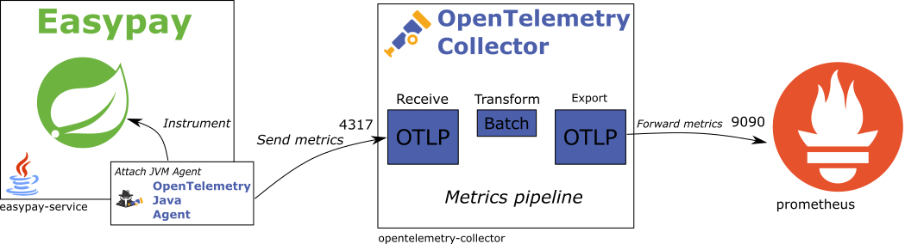

+++
title = "Metrics"
type = "chapter"
weight = 4
+++

Let’s take control of our application’s metrics!

We target to collect metrics from our services and forward them to the Prometheus time-series database.
As with logs, we will use the OpenTelemetry collector as a gateway to collect and forward these metrics.

{}