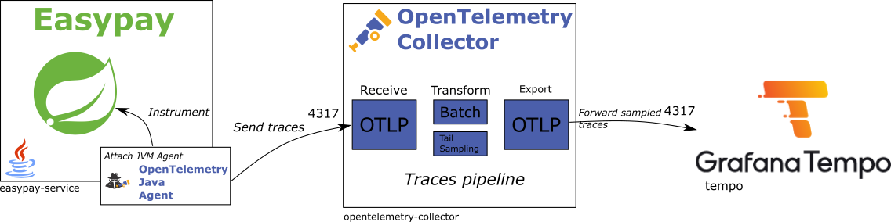

+++
title = "Traces"
type = "chapter"
weight = 5
+++

In this section, we'll explore **distributed tracing**, the third pillar of application observability.

Distributed tracing is an essential tool for monitoring and analyzing the performance of complex applications. It tracks
the flow of requests across multiple services and components, helping to identify bottlenecks and improve efficiency —
particularly useful for intricate systems like Easypay.

With Spring Boot, there are a couple of approaches to incorporate distributed tracing into your application:

* Utilize
  the [Spring Boot Actuator integration](https://docs.spring.io/spring-boot/docs/current/reference/html/actuator.html#actuator.tracing)
  with support from [Micrometer Tracing](https://docs.micrometer.io/docs/tracing),
* The Spring Boot Starter for OpenTelemetry, which provides an easy way to instrument your application using
  OpenTelemetry instrumentation libraries (but limited to a subset of all available libraries),
* Or adopt a broader [Java Agent approach](https://github.com/open-telemetry/opentelemetry-java-instrumentation)
  provided by the OpenTelemetry project, which automatically instruments our code when attached to our JVM regardless of
  the framework you use.

**For this workshop, we'll keep to use the Java Agent approach, as it's the most straightforward way to instrument our application
and independent of the libraries we use.**

The OpenTelemetry Collector will be used once again, tasked with receiving traces and forwarding them to the Tempo
backend.

> [!TIP]
> Utilizing collectors offers several advantages for managing telemetry data:
> - Reduces the need for complicated application configurations: just send data to `localhost`,
> - Centralizes configuration to a single point: the collector,
> - Acts as a buffer to prevent resource overuse,
> - Can transform data before ingestion,
> - Supports data intake from various protocols and can relay them to any backend,
> - ...

Lastly, we will use Grafana to examine and interpret these traces, allowing us to better understand and optimize our
application's performance.