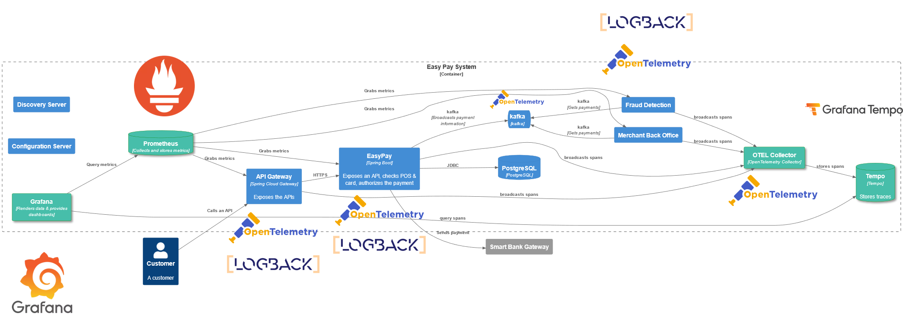

+++
date = '2025-06-05T22:56:29+02:00'
draft = false
title = 'Target Platform'
weight = 2
+++

## To a fully observable platform

### Short explanation

As mentioned earlier, our observability stack is composed of :

* [Prometheus](https://prometheus.io/) for gathering & storing the metrics
* [Loki](https://grafana.com/oss/loki/) for storing the logs
* [Tempo](https://grafana.com/oss/tempo/) for storing the traces
* [Grafana](https://grafana.com/) for the dashboards
* [OTEL collector](https://opentelemetry.io/docs/collector/) which gathers all the data to send it then to

In addition, the microservices are started with an agent to broadcast their telemetry to the collector.