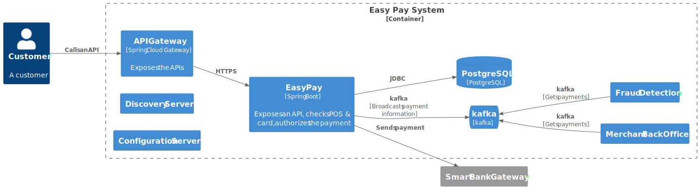

**author: David Pequegnot & Alexandre Touret
summary: Observability
id: observability-workshop
categories: observability
environments: Web
status: Published
feedback link: 

# Make your Java application fully observable with the Grafana Stack

## Introduction

This workshop aims to introduce how to make a Java application fully observable with:
* Proper logs with insightful information
* Metrics with [Prometheus](https://prometheus.io/)
* [Distributed Tracing](https://blog.touret.info/2023/09/05/distributed-tracing-opentelemetry-camel-artemis/)

During this workshop we will use the Grafana stack and Prometheus:

* [Grafana](https://grafana.com/): for dashboards
* [Loki](https://grafana.com/oss/loki/): for storing our logs
* [Tempo](https://grafana.com/oss/tempo/): for storing traces
* [Prometheus](https://prometheus.io/): for gathering and storing metrics.

We will also cover the OpenTelemetry Collector which gathers & broadcast then the data coming from our microservices

## Workshop overview
Duration: 0:02:00

### Application High Level Design



#### API Gateway
Centralises all API calls.

#### Easy Pay Service
Payment microservices which accepts (or not) payments.

This is how it validates every payment:
1. Check the POS number
2. Check the credit card number
3. Check the credit card type
4. Check the payment threshold, it calls the Smart Bank Gateway for authorization

If the payment is validated it stores it and broadcasts it to all the other microservices through Kafka.

#### Fraud detection Service

After fetching a message from the Kafka topic, this service search in its database if the payment's card number is registered for fraud.

In this case, only a WARN log is thrown.

#### Merchant Back Office Service

For this lab, it only simulates the subscription of messages.

#### Smart Bank Gateway
This external service authorizes the payment.

### Our fully observable platform


#### Short explanation

As mentioned earlier, our observability stack is composed of :
* [Prometheus](https://prometheus.io/) for gathering & storing the metrics
* [Loki](https://grafana.com/oss/loki/) for storing the logs
* [Tempo](https://grafana.com/oss/tempo/) for storing the traces
* [Grafana](https://grafana.com/) for the dashboards
* The [OTEL collector](https://opentelemetry.io/docs/collector/) which gathers all the data to send it then to 

In addition, the microservices are started with an agent to broadcast the traces to the collector.   

## Prerequisites
### Skills

| Skill                                                                                                                                                                                                                                                                                   | Level        | 
|-----------------------------------------------------------------------------------------------------------------------------------------------------------------------------------------------------------------------------------------------------------------------------------------|--------------|
| [REST API](https://google.aip.dev/general)                                                                                                                                                                                                                                              | proficient   |
| [Java](https://www.oracle.com/java/)                                                                                                                                                                                                                                                    | novice       |   
| [Gradle](https://gradle.org/)                                                                                                                                                                                                                                                           | novice       |
| [Spring Framework](https://spring.io/projects/spring-framework), [Boot](https://spring.io/projects/spring-boot), [Cloud Config](https://docs.spring.io/spring-cloud-config/docs/current/reference/html/#_quick_start), [Cloud Gateway](https://spring.io/projects/spring-cloud-gateway) | proficient |
| [Docker](https://docs.docker.com/)                                                                                                                                                                                                                                                      | novice       |
| [Grafana stack](https://grafana.com/)                                                                                                                                                                                                                                                   | novice       |
| [Prometheus](https://prometheus.io/)                                                                                                                                                                                                                                                    | novice       |
| [Kafka](https://kafka.apache.org/)                                                                                                                                                                                                                                                      | novice       |

### Tools
#### If you want to execute this workshop locally
You **MUST** have set up these tools first:
* [Java 21+](https://adoptium.net/temurin/releases/?version=21)
* [Gradle 8.7+](https://gradle.org/)
* [Docker](https://docs.docker.com/) & [Docker compose](https://docs.docker.com/compose/)
* Any IDE ([IntelliJ IDEA](https://www.jetbrains.com/idea), [VSCode](https://code.visualstudio.com/), [Netbeans](https://netbeans.apache.org/),...) you want
* [cURL](https://curl.se/), [jq](https://stedolan.github.io/jq/), [HTTPie](https://httpie.io/) or any tool to call your REST APIs

Here are commands to validate your environment:

**Java**

```jshelllanguage
$ java -version

openjdk version "21.0.3" 2024-04-16 LTS
OpenJDK Runtime Environment Temurin-21.0.3+9 (build 21.0.3+9-LTS)
OpenJDK 64-Bit Server VM Temurin-21.0.3+9 (build 21.0.3+9-LTS, mixed mode, sharing)
```

**Gradle**

If you use the wrapper, you won't have troubles. Otherwise...:

```jshelllanguage
$ gradle -version

    ------------------------------------------------------------
Gradle 8.7
        ------------------------------------------------------------

Build time:   2024-03-22 15:52:46 UTC
Revision:     650af14d7653aa949fce5e886e685efc9cf97c10

Kotlin:       1.9.22
Groovy:       3.0.17
Ant:          Apache Ant(TM) version 1.10.13 compiled on January 4 2023
JVM:          21.0.3 (Eclipse Adoptium 21.0.3+9-LTS)
OS:           Linux 5.15.146.1-microsoft-standard-WSL2 amd64
```

**Docker Compose**

``` bash
$ docker compose version
    
Docker Compose version v2.24.7
```

#### If you don't want to bother with a local setup

##### With Gitpod (recommended)
You can use [Gitpod](https://gitpod.io).
You must create an account first.
You then can open this project in either your local VS Code or directly in your browser:

[](https://github.com/worldline/observability-workshop/observability-workshop.git)

## Environment Setup
Duration: 0:05:00

### Open GitPod

We will assume you will use GitPod for this workshop :) 

[](https://gitpod.io/#github.com/alexandre-touret/observability-workshop.git)

### Start the infrastructure

The "infrastructure stack" is composed of the following components:
* One [PostgreSQL](https://www.postgresql.org/) instance per micro service
* One [Kafka broker](https://kafka.apache.org/)
* ONe [Service Discovery](https://spring.io/guides/gs/service-registration-and-discovery) microservice to enable load balancing & loose coupling.
* One [Configuration server](https://docs.spring.io/spring-cloud-config/) is also used to centralise the configuration of our microservices.

> aside positive
>
> The two last software are written and available in our GitHub Repository. 
> Normally, you should not have to restart them during the workshop

To run the whole, execute the following command

``` bash
$ docker compose up -d --build --remove-orphans
```
To check if all the services are up, you can run this command:

``` bash
$ docker compose ps -a
```

> aside negative
> 
> TODO ajouter retour commande

        
### Start the rest of our microservices
        
You can now start the application with the following commands.
For each you must start a new terminal in VSCode.

#### The REST Easy Pay Service
Run the following command:

```bash
$ ./gradlew :easypay-service:bootRun -x test
```

#### The Merchant BO
Run the following command:

```bash
$ ./gradlew :merchant-backoffice:bootRun -x test
```    
#### The Fraud System
Run the following command:

```bash
$ ./gradlew :frauddetect-service:bootRun -x test
```    

#### The Smart Bank Gateway
Run the following command:

```bash
$ ./gradlew :smartbank-gateway:bootRun -x test
```    

#### The API Gateway

Run the following command:

```bash
$ ./gradlew :api-gateway:bootRun -x test
```
#### Validation

Open the Eureka website started during the infrastructure setup

If you run this workshop on your desktop, you can go to this URL.
If you run it on GitPod, you can go the corresponding URL (e.g., TODO) instead.

You can now reach our platform to initiate a payment:

```bash
$ http POST :8080/api/easypay/payments posId=POS-01 cardNumber=5555567898780008 expiryDate=789456123 amount:=25000
```

You should get the following content:

```bash
HTTP/1.1 201 Created
Content-Type: application/json
Date: Wed, 05 Jun 2024 13:42:12 GMT
Location: http://172.19.25.95:44523/payments/3cd8df14-8c39-460b-a429-dc113d003aed
transfer-encoding: chunked

{
    "amount": 25000,
    "authorId": "5d364f1a-569c-4c1d-9735-619947ccbea6",
    "authorized": true,
    "bankCalled": true,
    "cardNumber": "5555567898780008",
    "cardType": "MASTERCARD",
    "expiryDate": "789456123",
    "paymentId": "3cd8df14-8c39-460b-a429-dc113d003aed",
    "posId": "POS-01",
    "processingMode": "STANDARD",
    "responseCode": "ACCEPTED",
    "responseTime": 414
}
```

## Logs 
Duration: 0:30:00

### Some functional issues
One of our customers raised an issue: 

> When I reach your API, I usually either an ``AMOUNT_EXCEEDED`` or ``INVALID_CARD_NUMBER`` error.

Normally the first thing to do is checking the logs. 
Before that, we will reproduce these issues.

You can check the API as following:

For the ``AMOUNT_EXCEEDED`` error:

```bash
$ http POST :8080/api/easypay/payments posId=POS-01 cardNumber=5555567898780008 expiryDate=789456123 amount:=51000

HTTP/1.1 201 Created
Content-Type: application/json
Date: Wed, 05 Jun 2024 13:45:40 GMT
Location: http://172.19.25.95:44523/payments/5459b20a-ac91-458f-9578-019c05483bb3
transfer-encoding: chunked

{
    "amount": 51000,
    "authorId": "6ace318f-b669-4e4a-b366-3f09048becb7",
    "authorized": false,
    "bankCalled": true,
    "cardNumber": "5555567898780008",
    "cardType": "MASTERCARD",
    "expiryDate": "789456123",
    "paymentId": "5459b20a-ac91-458f-9578-019c05483bb3",
    "posId": "POS-01",
    "processingMode": "STANDARD",
    "responseCode": "AUTHORIZATION_DENIED",
    "responseTime": 25
}
```

And for the ``INVALID_CARD_NUMBER`` error:

```bash
$  http POST :8080/api/easypay/payments posId=POS-01 cardNumber=5555567898780007 expiryDate=789456123 amount:=51000

HTTP/1.1 201 Created
Content-Type: application/json
Date: Wed, 05 Jun 2024 13:46:09 GMT
Location: http://172.19.25.95:44523/payments/2dbf3823-fb11-4c63-a540-ab43ac663e68
transfer-encoding: chunked

{
    "amount": 51000,
    "authorId": null,
    "authorized": false,
    "bankCalled": false,
    "cardNumber": "5555567898780007",
    "cardType": null,
    "expiryDate": "789456123",
    "paymentId": "2dbf3823-fb11-4c63-a540-ab43ac663e68",
    "posId": "POS-01",
    "processingMode": "STANDARD",
    "responseCode": "INVALID_CARD_NUMBER",
    "responseTime": 5
}

```

Go then to the log folder (TODO) , look around the log files and look into these issues.

You should get these log entries:


> aside negative
>
> TODO CHEMIN et message à chercher, exemple de logs, commande HTTPIE

> aside negative
>
> As you can see, the logs are not helpful for getting more information such as the business or user context.~~~~
> 
> If you want to dig into this particular topic, you can check out [this article](https://blog.worldline.tech/2020/01/22/back-to-basics-logging.html).

### Let's fix it!

It's time to add more contextual information into our code!

We will use in this workshop SLF4J.

The logger can be created by adding a class variable such as:

```java
  private static final Logger log = LoggerFactory.getLogger(BankAuthorService.class);
```
Think to use the corresponding class to instantiate it! 

#### What about log levels?

Use the most appropriate log level

The log level is a fundamental concept in logging, no matter which logging framework you use. It allows you to tag log records according to their severity or importance. SLF4J offers the following log levels by default:

* ``TRACE`` : typically used to provide detailed diagnostic information that can be used for troubleshooting and debugging. Compare to DEBUG messages, TRACE messages are more fine-grained and verbose.
* ``DEBUG``: used to provide information that can be used to diagnose issues especially those related to program state.
* ``INFO``: used to record events that indicate that program is functioning normally.
* ``WARN``: used to record potential issues in your application. They may not be critical but should be investigated.
* ``ERROR``: records unexpected errors that occur during the operation of your application. In most cases, the error should be addressed as soon as possible to prevent further problems or outages.


#### ``AMOUNT_EXCEEDED`` issue

Go the ``easypay-service/src/main/java/com/worldline/easypay/payment/control/bank/BankAuthorService.java`` class and modify the following code block
```java
@Retry(name = "BankAuthorService", fallbackMethod = "acceptByDelegation")
public boolean authorize(PaymentProcessingContext context) {
 log.info("Authorize payment for {}", context);
 try {
  var response = client.authorize(initRequest(context));
  context.bankCalled = true;
  context.authorId = Optional.of(response.authorId());
  context.authorized = response.authorized();
  return context.authorized;
 } catch (Exception e) {
  log.warn("Should retry or fallback: {}", e.getMessage());
  throw e;
 }
}
```

Modify the exception trace to provide contextual information such as the authorId, the status of the call and the result. 

#### ``INVALID_CARD_NUMBER`` issue
Go to the ``easypay-service/src/main/java/com/worldline/easypay/payment/control/CardValidator.java`` class and modify the following block code in the process method in the same way:

```java
   private void process(PaymentProcessingContext context) {
[...]

 if (!cardValidator.checkCardNumber(context.cardNumber)) {
  context.responseCode = PaymentResponseCode.INVALID_CARD_NUMBER;
  return;
 }

[...]

```

For this error, you can log the error with the following content:

* The attributes of the ``PaymentProcessingContext `` 
* The error message

### Check your code

You can restart your easy pay service by typing ``CTRL+C`` in your console prompt, and run the following command:

> aside negative
>
> TODO mettre la commande + le résultat dans les logs

Now you can run the same commands ran earlier and check the logs.

### A technical issue

Another issue was raised for the POS (Point of Sell) ``POS-02``. 
When you reach the API using this command:

```bash
http POST :8080/api/easypay/payments posId=POS-02 cardNumber=5555567898780008 expiryDate=789456123 amount:=25000
```

You get the following log message:

```bash
2024-06-05T15:45:35.215+02:00 ERROR 135386 --- [easypay-service] [o-auto-1-exec-7] o.a.c.c.C.[.[.[/].[dispatcherServlet]    : Servlet.service() for servlet [dispatcherServlet] in context with path [] threw exception [Request processing failed: java.lang.NullPointerException: Cannot invoke "java.lang.Boolean.booleanValue()" because "java.util.List.get(int).active" is null] with root cause

java.lang.NullPointerException: Cannot invoke "java.lang.Boolean.booleanValue()" because "java.util.List.get(int).active" is null
        at com.worldline.easypay.payment.control.PosValidator.isActive(PosValidator.java:34) ~[main/:na]
        at com.worldline.easypay.payment.control.PaymentService.process(PaymentService.java:46) ~[main/:na]
        at com.worldline.easypay.payment.control.PaymentService.accept(PaymentService.java:108) ~[main/:na]
        at java.base/jdk.internal.reflect.DirectMethodHandleAccessor.invoke(DirectMethodHandleAccessor.java:103) ~[na:na]
        at java.base/java.lang.reflect.Method.invoke(Method.java:580) ~[na:na]
        at org.springframework.aop.support.AopUtils.invokeJoinpointUsingReflection(AopUtils.java:354) ~[spring-aop-6.1.6.jar:6.1.6]
        at org.springframework.aop.framework.ReflectiveMethodInvocation.invokeJoinpoint(ReflectiveMethodInvocation.java:196) ~[spring-aop-6.1.6.jar:6.1.6]
        at org.springframework.aop.framework.ReflectiveMethodInvocation.proceed(ReflectiveMethodInvocation.java:163) ~[spring-aop-6.1.6.jar:6.1.6]
    [...]
```

First, add a _smart_ log entry in the ``easypay-service/src/main/java/com/worldline/easypay/payment/control/PosValidator.java`` class.

In the ``isActive()`` method, catch the exception and trace the error:
> aside negative
>
> TODO Commande pour le message d'erreur + message d'erreur
>

You can also prevent this issue by simply fixing the SQL import file

In the file ``easypay-service/src/main/resources/db/postgresql/data.sql``, Modify the implied line for ``POS-02`` from:

```sql 
INSERT INTO pos_ref(id, pos_id, location, active) VALUES (2, 'POS-02', 'Blois France', NULL) ON CONFLICT DO NOTHING;
```

to 

```sql 
INSERT INTO pos_ref(id, pos_id, location, active) VALUES (2, 'POS-02', 'Blois France', true) ON CONFLICT DO NOTHING;
```

### Logs Correlation  
> aside positive
>
> You are probably wondering how to smartly debug in production when you have plenty of logs for several users and by the way different transactions?
>
> One approach would be to correlate all of your logs using a correlation Id.
> If an incoming request has no correlation id header, the API creates it. If there is one, it uses it instead.

> aside negative
>
> TODO mettre la manipulation pour le correlation ID et un exemple d'utilisation

### Let's dive into our logs on Grafana!

Logs are stored in the logs folder.

We use then [Promtail to broadcast them to Loki](https://grafana.com/grafana/dashboards/14055-loki-stack-monitoring-promtail-loki/).

Open a browser page to Grafana.
Open the dashboard, try to search with a correlation ID

> aside negative
>
> Documenter

## Metrics
Duration: 0:30:00

## Traces
Duration: 0:20:00

## Correlate Traces, Logs
Duration: 0:15:00

## Performance testing: ALL IN!!
Duration: 0:15:00
