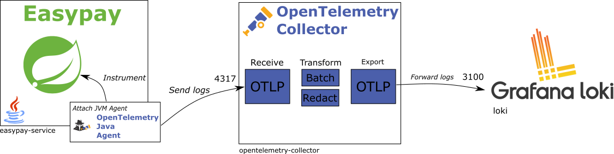
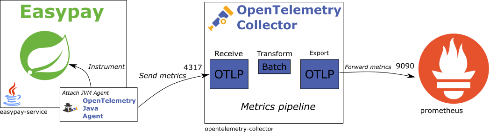
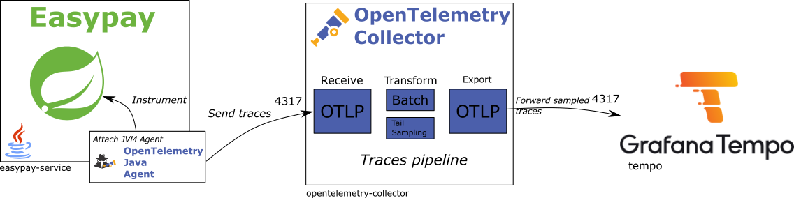

authors: David Pequegnot & Alexandre Touret
summary: Observability from Development: Master Your Java Applications in Production with Open Telemetry
id: observability-workshop
categories: observability, java
environments: Web
status: Published
feedback link: https://github.com/worldline/observability-workshop/issues

# Observability from Development: Master Your Java Applications in Production with Open Telemetry

## Introduction

This workshop aims to introduce how to make a Java application fully observable with:

* Logs with insightful information
* Metrics with [Prometheus](https://prometheus.io/)
* [Distributed Tracing](https://blog.touret.info/2023/09/05/distributed-tracing-opentelemetry-camel-artemis/)

During this workshop we will use OpenTelemetry and a Grafana stack:

* [Grafana](https://grafana.com/): for dashboards
* [Loki](https://grafana.com/oss/loki/): for storing our logs
* [Tempo](https://grafana.com/oss/tempo/): for storing traces
* [Prometheus](https://prometheus.io/): for gathering and storing metrics.

We will also cover the:

* OpenTelemetry Protocol (OTLP) to send our telemetry data over the network,
* [OpenTelemetry Collector](https://opentelemetry.io/docs/collector/) which gathers & broadcasts
  then the data coming from our microservices,
* And obviously the OpenTelemetry Java instrumentation to collect all the telemetry data of our application.

## Workshop overview

### Application High Level Design


#### API Gateway

Centralises all API calls.

#### Easy Pay Service

Payment microservices which accepts (or not) payments.

This is how it validates every payment:

1. Check the POS (Point of Sell) number
2. Check the credit card number
3. Check the credit card type
4. Check the payment threshold, it calls the Smart Bank Gateway for authorization

If the payment is validated, it stores it and broadcasts it to all the other microservices through Kafka.

#### Fraud detection Service

After fetching a message from the Kafka topic, this service search in its database if the payment's card number is
registered for fraud.

In this case, only a ``WARN`` log is thrown.

#### Merchant Back Office Service

For this lab, it only simulates the subscription of messages.

#### Smart Bank Gateway

This external service authorizes the payment.

### Our fully observable platform


#### Short explanation

As mentioned earlier, our observability stack is composed of :

* [Prometheus](https://prometheus.io/) for gathering & storing the metrics
* [Loki](https://grafana.com/oss/loki/) for storing the logs
* [Tempo](https://grafana.com/oss/tempo/) for storing the traces
* [Grafana](https://grafana.com/) for the dashboards
* [OTEL collector](https://opentelemetry.io/docs/collector/) which gathers all the data to send it then to

In addition, the microservices are started with an agent to broadcast their telemetry to the collector.

### Icons

You will the following icons during the workshop:

🛠️ An action to perform,  
📝 A file to modify,  
👀 Something to observe,  
✅ Validate something,  
ℹ️ Some information.

## Prerequisites

### Skills

| Skill                                                                                                                                                                                                                                                                                   | Level      | 
|-----------------------------------------------------------------------------------------------------------------------------------------------------------------------------------------------------------------------------------------------------------------------------------------|------------|
| [REST API](https://google.aip.dev/general)                                                                                                                                                                                                                                              | proficient |
| [Java](https://www.oracle.com/java/)                                                                                                                                                                                                                                                    | proficient |   
| [Gradle](https://gradle.org/)                                                                                                                                                                                                                                                           | novice     |
| [Spring Framework](https://spring.io/projects/spring-framework), [Boot](https://spring.io/projects/spring-boot), [Cloud Config](https://docs.spring.io/spring-cloud-config/docs/current/reference/html/#_quick_start), [Cloud Gateway](https://spring.io/projects/spring-cloud-gateway) | proficient |
| [Docker](https://docs.docker.com/)                                                                                                                                                                                                                                                      | novice     |
| [Grafana stack](https://grafana.com/)                                                                                                                                                                                                                                                   | novice     |
| [Prometheus](https://prometheus.io/)                                                                                                                                                                                                                                                    | novice     |
| [Kafka](https://kafka.apache.org/)                                                                                                                                                                                                                                                      | novice     |

### Tools
#### If you want to execute this workshop on your desktop with [DevContainers](https://containers.dev/)

I stored a configuration to set the project up in DevContainer. You can check it out in the project [``.devcontainer/devcontainer.json``](https://github.com/worldline/observability-workshop/tree/main/.devcontainer) file.

If you want to know more about DevContainers, you can check out this [documentation](https://containers.dev/).

You **MUST** have set up these tools first:

* [Docker](https://docs.docker.com/)
* An IDE: ([IntelliJ IDEA](https://www.jetbrains.com/idea) or [VSCode](https://code.visualstudio.com/)).

🛠️ You can validate your environment running these commands:

**Docker**

```jshelllanguage
$ docker version
    Client:
    Docker Engine -Community
    Version:
    27.4.1
    API version:1.47
    Go version:go1.22.10
    Git commit:b9d17ea
    Built:Tue Dec 17 15:45:46 2024
    OS/Arch:linux/amd64
    Context:default

```

#### If you want to execute this workshop on your desktop (without DevContainer) 

You **MUST** have set up these tools first:

* [Java 21+](https://adoptium.net/temurin/releases/?version=21)
* [Gradle 8.7+](https://gradle.org/)
* [Docker](https://docs.docker.com/) & [Docker compose](https://docs.docker.com/compose/)
* Any
  IDE ([IntelliJ IDEA](https://www.jetbrains.com/idea), [VSCode](https://code.visualstudio.com/), [Netbeans](https://netbeans.apache.org/),...)
  you want
* [cURL](https://curl.se/), [jq](https://stedolan.github.io/jq/), [HTTPie](https://httpie.io/) or any tool to call your
  REST APIs

🛠️ Here are commands to validate your environment:

**Java**

```bash
$ java -version

openjdk version "21.0.3" 2024-04-16 LTS
OpenJDK Runtime Environment Temurin-21.0.3+9 (build 21.0.3+9-LTS)
OpenJDK 64-Bit Server VM Temurin-21.0.3+9 (build 21.0.3+9-LTS, mixed mode, sharing)
```

**Gradle**

🛠️ If you use the wrapper, you won't have troubles. Otherwise...:

```bash
$ gradle -version

------------------------------------------------------------
Gradle 8.7
------------------------------------------------------------

Build time:   2024-03-22 15:52:46 UTC
Revision:     650af14d7653aa949fce5e886e685efc9cf97c10

Kotlin:       1.9.22
Groovy:       3.0.17
Ant:          Apache Ant(TM) version 1.10.13 compiled on January 4 2023
JVM:          21.0.3 (Eclipse Adoptium 21.0.3+9-LTS)
OS:           Linux 5.15.146.1-microsoft-standard-WSL2 amd64
```

**Docker Compose**

``` bash
$ docker compose version
    
Docker Compose version v2.24.7
```

#### If you don't want to bother with a local setup

It's strongly recommended to use [Gitpod](https://gitpod.io)
or [GitHub Codespaces](https://github.com/features/codespaces).
You must create an account first.
You then can open this project in either your local VS Code or directly in your browser:

[](https://gitpod.io/#github.com/worldline/observability-workshop.git)

## Environment Setup

In this chapter, you will learn how to start either GitPod or GitHub Codespaces.

### Open GitPod

We will assume you will use GitPod for this workshop :)

[](https://gitpod.io/#github.com/worldline/observability-workshop.git)

When a messages invites you making an URL public, select and validate it.

### 🛠  Open Github CodeSpaces

* Log on [GitHub](https://github.com/) and
  [fork this repository](https://github.com/worldline/observability-workshop/fork).
* Click on ``Code>Codespaces>Create a codespace`` on the ``main`` branch


When a message invites you making a URL public, select and validate it.

Wait until the codeSpace is ready.


During the first startup, the maven build is automatically started. Please wait until it is completely finished.

### Start the infrastructure

The "infrastructure stack" is composed of the following components:

* One [PostgreSQL](https://www.postgresql.org/) instance per micro service
* One [Kafka broker](https://kafka.apache.org/)
* One [Service Discovery](https://spring.io/guides/gs/service-registration-and-discovery) microservice to enable load
  balancing & loose coupling.
* One [Configuration server](https://docs.spring.io/spring-cloud-config/) is also used to centralise the configuration
  of our microservices.
* The following microservices: API Gateway, Merchant BO, Fraud Detect, Smart Bank Gateway

ℹ️ If you run your application on GitPod, the following step are automatically started during the provisioning of your
GitPod environment.

🛠️ Otherwise, to run it on your desktop, execute the following commands

``` bash
$ bash scripts/download-agent.sh
```

``` bash
$ ./gradlew tasks
```

``` bash
$ docker compose up -d --build --remove-orphans
```

✅ To check if all the services are up, you can run this command:

``` bash
$ docker compose ps -a
```

And check the status of every service.

For instance:

```bash
❯ docker compose ps
NAME                                               IMAGE                                         COMMAND                  SERVICE                   CREATED         STATUS                        PORTS
api-gateway                                        api-gateway:latest                            "java -javaagent:/op…"   api-gateway               3 minutes ago   Up 2 minutes (healthy)        0.0.0.0:8080->8080/tcp, :::8080->8080/tcp
config-server                                      config-server:latest                          "java -javaagent:/op…"   config-server             3 minutes ago   Up 3 minutes (healthy)        0.0.0.0:8888->8888/tcp, :::8888->8888/tcp
discovery-server                                   discovery-server:latest                       "java -javaagent:/op…"   discovery-server          3 minutes ago   Up 3 minutes (healthy)        0.0.0.0:8761->8761/tcp, :::8761->8761/tcp
easypay-service                                    easypay-service:latest                        "java -cp app:app/li…"   easypay-service           3 minutes ago   Up 2 minutes (healthy)        
fraudetect                                         fraudetect-service:latest                     "java -javaagent:/op…"   fraudetect-service        3 minutes ago   Up 2 minutes (healthy)        
kafka                                              confluentinc/cp-kafka:7.6.1                   "/etc/confluent/dock…"   kafka                     3 minutes ago   Up 3 minutes (healthy)        9092/tcp, 0.0.0.0:19092->19092/tcp, :::19092->19092/tcp
merchant-backoffice                                merchant-backoffice:latest                    "java -javaagent:/op…"   merchant-backoffice       3 minutes ago   Up 2 minutes (healthy)        
observability-workshop-grafana-1                   grafana/grafana:latest                        "sh -xeuc 'mkdir -p …"   grafana                   3 minutes ago   Up 3 minutes                  0.0.0.0:3000->3000/tcp, :::3000->3000/tcp
observability-workshop-loki-1                      grafana/loki:latest                           "/usr/bin/loki -conf…"   loki                      3 minutes ago   Up 3 minutes                  0.0.0.0:3100->3100/tcp, :::3100->3100/tcp
observability-workshop-opentelemetry-collector-1   otel/opentelemetry-collector-contrib:latest   "/otelcol-contrib --…"   opentelemetry-collector   3 minutes ago   Up 3 minutes                  0.0.0.0:4317-4318->4317-4318/tcp, :::4317-4318->4317-4318/tcp, 55678-55679/tcp
observability-workshop-postgres-easypay-1          postgres:16                                   "docker-entrypoint.s…"   postgres-easypay          3 minutes ago   Up 3 minutes (healthy)        0.0.0.0:5432->5432/tcp, :::5432->5432/tcp
observability-workshop-postgres-fraudetect-1       postgres:16                                   "docker-entrypoint.s…"   postgres-fraudetect       3 minutes ago   Up 3 minutes (healthy)        0.0.0.0:5434->5432/tcp, [::]:5434->5432/tcp
observability-workshop-postgres-merchantbo-1       postgres:16                                   "docker-entrypoint.s…"   postgres-merchantbo       3 minutes ago   Up 3 minutes (healthy)        0.0.0.0:5435->5432/tcp, [::]:5435->5432/tcp
observability-workshop-postgres-smartbank-1        postgres:16                                   "docker-entrypoint.s…"   postgres-smartbank        3 minutes ago   Up 3 minutes (healthy)        0.0.0.0:5433->5432/tcp, [::]:5433->5432/tcp
observability-workshop-prometheus-1                prom/prometheus:latest                        "/bin/prometheus --c…"   prometheus                3 minutes ago   Up 3 minutes                  0.0.0.0:9090->9090/tcp, :::9090->9090/tcp
observability-workshop-pyroscope-1                 grafana/pyroscope:latest                      "/usr/bin/pyroscope …"   pyroscope                 12 hours ago    Exited (255) 38 minutes ago   0.0.0.0:4040->4040/tcp, :::4040->4040/tcp
observability-workshop-tempo-1                     grafana/tempo:latest                          "/tempo -config.file…"   tempo                     3 minutes ago   Up 3 minutes                  0.0.0.0:3200->3200/tcp, :::3200->3200/tcp, 0.0.0.0:9095->9095/tcp, :::9095->9095/tcp, 0.0.0.0:9411->9411/tcp, :::9411->9411/tcp
smartbank-gateway                                  smartbank-gateway:latest                      "java -Xmx4g -cp app…"   smartbank-gateway         3 minutes ago   Up 2 minutes (healthy)
```

#### Validation

✅ Open the [Eureka](https://cloud.spring.io/spring-cloud-netflix/) website started during the infrastructure setup. The
following instances should be registered with Eureka:

* API-GATEWAY
* EASYPAY-SERVICE
* FRAUDETECT-SERVICE
* MERCHANT-BACKOFFICE
* SMARTBANK-GATEWAY

> aside positive
>
> If you run this workshop on your desktop, you can go to this URL: [http://localhost:8761](http://localhost:8761).    
> If you run it on GitPod, you can go to the corresponding URL (
> e.g., https://8761-worldline-observability-w98vrd59k5h.ws-eu114.gitpod.io) instead by going into the `PORTS` view and
> select the url next to the port `8761`.

✅ All services should be registered before continuing…

🛠️ You can now access our platform to initiate a payment:

```bash
$ http POST :8080/api/easypay/payments posId=POS-01 cardNumber=5555567898780008 expiryDate=789456123 amount:=25000
```

✅ You should get the following content:

```bash
HTTP/1.1 201 Created
Content-Type: application/json
Date: Wed, 05 Jun 2024 13:42:12 GMT
Location: http://172.19.25.95:44523/payments/3cd8df14-8c39-460b-a429-dc113d003aed
transfer-encoding: chunked

{
    "amount": 25000,
    "authorId": "5d364f1a-569c-4c1d-9735-619947ccbea6",
    "authorized": true,
    "bankCalled": true,
    "cardNumber": "5555567898780008",
    "cardType": "MASTERCARD",
    "expiryDate": "789456123",
    "paymentId": "3cd8df14-8c39-460b-a429-dc113d003aed",
    "posId": "POS-01",
    "processingMode": "STANDARD",
    "responseCode": "ACCEPTED",
    "responseTime": 414
}
```

## Logs

### Some functional issues

🛠️ It’s time to have a look to our `easypay-service` logs!  
Service is started in a Docker container. To get its output you can use the following command:

```bash
$ docker compose logs -f easypay-service
```

One of our customers raised an issue:

> « When I reach your API, I usually either an ``AMOUNT_EXCEEDED`` or ``INVALID_CARD_NUMBER`` error. »

Normally the first thing to do is checking the logs.
Before that, we will reproduce this behavior.

🛠️ You can check the API as following:

* For the ``AMOUNT_EXCEEDED`` error (any ``amount`` above 50000 would give the same result):

```bash
$ http POST :8080/api/easypay/payments posId=POS-01 cardNumber=5555567898780008 expiryDate=789456123 amount:=51000

HTTP/1.1 201 Created
Content-Type: application/json
Date: Wed, 05 Jun 2024 13:45:40 GMT
Location: http://172.19.25.95:44523/payments/5459b20a-ac91-458f-9578-019c05483bb3
transfer-encoding: chunked

{
    "amount": 51000,
    "authorId": "6ace318f-b669-4e4a-b366-3f09048becb7",
    "authorized": false,
    "bankCalled": true,
    "cardNumber": "5555567898780008",
    "cardType": "MASTERCARD",
    "expiryDate": "789456123",
    "paymentId": "5459b20a-ac91-458f-9578-019c05483bb3",
    "posId": "POS-01",
    "processingMode": "STANDARD",
    "responseCode": "AUTHORIZATION_DENIED",
    "responseTime": 25
}
```

* And for the ``INVALID_CARD_NUMBER`` error:

```bash
$  http POST :8080/api/easypay/payments posId=POS-01 cardNumber=5555567898780007 expiryDate=789456123 amount:=25000

HTTP/1.1 201 Created
Content-Type: application/json
Date: Wed, 05 Jun 2024 13:46:09 GMT
Location: http://172.19.25.95:44523/payments/2dbf3823-fb11-4c63-a540-ab43ac663e68
transfer-encoding: chunked

{
    "amount": 51000,
    "authorId": null,
    "authorized": false,
    "bankCalled": false,
    "cardNumber": "5555567898780007",
    "cardType": null,
    "expiryDate": "789456123",
    "paymentId": "2dbf3823-fb11-4c63-a540-ab43ac663e68",
    "posId": "POS-01",
    "processingMode": "STANDARD",
    "responseCode": "INVALID_CARD_NUMBER",
    "responseTime": 5
}

```

👀 Look into the console `logs` to pinpoint these issues.

> aside positive
>
> As you can see, logs can give you quickly some information.
>
> They are easy to implement as most of our frameworks provides a logging mechanism (here logback, but could be log4j,
> log4j2, etc.). Unfortunately, they are also dependent of the work of the developer to be insightful, who can also miss
> some important information.
>
> If you want to dig into this particular topic, you can check out this
> article: [Back to basics - Logging](https://blog.worldline.tech/2020/01/22/back-to-basics-logging.html).

#### Additional logs

It's time to add more contextual information into our code!

We will use in this workshop SLF4J. It is a logging facade that provides a simple API to log messages, and which can be
bind to different logging frameworks (Logback, Log4j, etc.).

The logger can be created by adding a static class variable such as:

```java
  private static final Logger log = LoggerFactory.getLogger(PaymentResource.class);
```

Think to use the corresponding class to instantiate it!

##### What about log levels?

Use the most appropriate log level

The log level is a fundamental concept in logging. Whether the logging framework you use, it allows you to tag log
records according to their severity or importance.
For instance, [SLF4J](https://www.slf4j.org/) offers
the [following log levels by default](https://www.slf4j.org/apidocs/org/slf4j/event/Level.html):

* ``TRACE`` : typically used to provide detailed diagnostic information that can be used for troubleshooting and
  debugging. Compare to DEBUG messages, TRACE messages are more fine-grained and verbose.
* ``DEBUG``: used to provide information that can be used to diagnose issues especially those related to program state.
* ``INFO``: used to record events that indicate that program is functioning normally.
* ``WARN``: used to record potential issues in your application. They may not be critical but should be investigated.
* ``ERROR``: records unexpected errors that occur during the operation of your application. In most cases, the error
  should be addressed as soon as possible to prevent further problems or outages.

We can also log payment requests and responses to provide even more context, which could be helpful for following
requests in this workshop.

##### Add logs

📝 Modify the `easypay-service/src/main/java/com/worldline/easypay/payment/boundary/PaymentResource.java` class by
uncommenting all `// LOG.…` lines (keep MDC lines for later 😉).

### Ze technical issue

Another issue was raised for the POS (Point of Sell) ``POS-02`` (but we didn’t know yet!).

🛠️ When you reach the API using this command:

```bash
http POST :8080/api/easypay/payments posId=POS-02 cardNumber=5555567898780008 expiryDate=789456123 amount:=25000
```

👀 You should get the following output:

````bash

HTTP/1.1 500
[...]

{
  "error":"Internal Server Error",
  "path": "/payments",
  "status": 500,
  [...]
}
````

👀 You then get the following log message:

```bash
2024-06-05T15:45:35.215+02:00 ERROR 135386 --- [easypay-service] [o-auto-1-exec-7] o.a.c.c.C.[.[.[/].[dispatcherServlet]    : Servlet.service() for servlet [dispatcherServlet] in context with path [] threw exception [Request processing failed: java.lang.NullPointerException: Cannot invoke "java.lang.Boolean.booleanValue()" because "java.util.List.get(int).active" is null] with root cause

java.lang.NullPointerException: Cannot invoke "java.lang.Boolean.booleanValue()" because "java.util.List.get(int).active" is null
        at com.worldline.easypay.payment.control.PosValidator.isActive(PosValidator.java:34) ~[main/:na]
        at com.worldline.easypay.payment.control.PaymentService.process(PaymentService.java:46) ~[main/:na]
        at com.worldline.easypay.payment.control.PaymentService.accept(PaymentService.java:108) ~[main/:na]
        at java.base/jdk.internal.reflect.DirectMethodHandleAccessor.invoke(DirectMethodHandleAccessor.java:103) ~[na:na]
        at java.base/java.lang.reflect.Method.invoke(Method.java:580) ~[na:na]
        at org.springframework.aop.support.AopUtils.invokeJoinpointUsingReflection(AopUtils.java:354) ~[spring-aop-6.1.6.jar:6.1.6]
        at org.springframework.aop.framework.ReflectiveMethodInvocation.invokeJoinpoint(ReflectiveMethodInvocation.java:196) ~[spring-aop-6.1.6.jar:6.1.6]
        at org.springframework.aop.framework.ReflectiveMethodInvocation.proceed(ReflectiveMethodInvocation.java:163) ~[spring-aop-6.1.6.jar:6.1.6]
    [...]
```

#### Let's fix it!

📝 To find the root cause, add first a _smart_ log entry in the
``easypay-service/src/main/java/com/worldline/easypay/payment/control/PosValidator.java`` class. In the ``isActive()``
method, catch the exception and trace the error:

```java
public boolean isActive(String posId) {
    PosRef probe = new PosRef();
    probe.posId = posId;
    try {
        List<PosRef> posList = posRefRepository.findAll(Example.of(probe));

        if (posList.isEmpty()) {
            LOG.warn("checkPosStatus NOK, unknown posId {}", posId);
            return false;
        }

        boolean result = posList.get(0).active;

        if (!result) {
            LOG.warn("checkPosStatus NOK, inactive posId {}", posId);
        }
        return result;
    } catch (NullPointerException e) {
        LOG.warn("Invalid value for this POS: {}", posId);
        throw e;
    }
}
```

🛠️ You can redeploy the `easypay-service` with the following commands:

```bash
$ docker compose up -d --build easypay-service
```

🛠️ Now you can run the same commands ran earlier and check again the logs (`http POST…`).

This is most likely an issue with some data in the database… Thanks to logs, we may quickly get the idea that the
problem comes from the point of sale with ID `POS-02`.

It is easy to identify the issue if we don’t have traffic against our application, but what if we have more realistic
traffic?

🛠️ Generate some load with `k6` (a Grafana tool for load testing):

```bash
$ k6 run -u 5 -d 30s k6/01-payment-only.js
```

👀 Check again logs:

```bash
$ docker compose logs -f easypay-service
```

Logs are now interleaved due to several requests being executed concurrently. It becomes harder to identify which point
of sale is causing this error...

👀 If you look into the SQL import file (`easypay-service/src/main/resources/db/postgresql/data.sql`), you'll notice a
`NULL` value instead of a boolean for the `active` column.

> aside negative
>
> Let’s keep the issue as it is for now.


### Using Mapped Diagnostic Context (MDC) to get more insights

Mapped Diagnostic Context (MDC) will help us add more context on every log output. For more information, refer to this
web page: [https://logback.qos.ch/manual/mdc.html](https://logback.qos.ch/manual/mdc.html).
It is a kind of Map attached to the Thread context and maintained by the logging framework where you can put values and
use them in your log layout.

As it is attached to a Thread, we can put values at the beginning of a request and print them in all the logs related to
this request.
That can give you a lot of information about the context of the request, without having to add them to all logs
manually.

A good sketch is better than a long speech. In the next section, we will use MDC to add the card number and the POS ID
to all the logs related to a request.

📝 Go to the ``easypay-service/src/main/java/com/worldline/easypay/payment/boundary/PaymentResource`` class and modify
the method ``processPayment()`` to instantiate the [MDC](https://logback.qos.ch/manual/mdc.html):

```java
public ResponseEntity<PaymentResponse> processPayment(PaymentRequest paymentRequest) {
    // Add cardNumber to SLF4J MDC 
    MDC.put("cardNumber",paymentRequest.cardNumber());
    // Add Point Of Sale identifier to SLF4J MDC
    MDC.put("pos",paymentRequest.posId());
            
    try { // Add a try-finally construct and wrap the initial code here 
        //...
        return httpResponse;
    } finally {
        // Clear MDC at the end
        MDC.clear();
    }
}
```

> aside negative
>
> Don’t forget to clear the MDC at the end of the method to avoid any memory leak.

Now, we want to print these values when a log line is printed in the console.

📝 Modify to the spring configuration file (``easypay-service/src/main/resources/application.yaml``) and modify the
`logging.level.pattern` property to add both the ``cardNumber`` & ``pos``fields to all logs:

```yaml
logging:
  pattern:
    level: "%5p [%mdc]"
```

> aside positive
>
> `%mdc` prints the full content of the MDC Map attached to the current thread.
>
> If you want to print a single value, you can use `%X{key}` where `key` is the key of the value you want to print.

```yaml
# Alternative to print specific fields instead
logging:
  pattern:
    level: "%5p [%X{cardNumber} - %X{pos}]"
```

> aside positive
>
> Using the Spring Boot ``logging.pattern.level`` property is just a way to configure the logback pattern. You can also
> use a logback configuration file to do the same thing.  
> You can also use the ``logging.pattern.correlation`` property (used by tracing) or a logback configuration file to do
> the same thing.

🛠️ Rebuild and redeploy the `easypay-service`:

```bash
$ docker compose up -d --build easypay-service
```

### Adding more content in our logs

🛠️ To have more logs, we will run several HTTP requests using [K6](https://k6.io/). Run the following command:

```bash
$ k6 run -u 5 -d 5s k6/01-payment-only.js
```

👀 Check then the logs to pinpoint some exceptions.

### Logs Correlation

> aside positive
>
> You are probably wondering how to smartly debug in production when you have plenty of logs for several users and by
> the way different transactions?
>
> One approach would be to correlate all of your logs using a correlation Id.
> If an incoming request has no correlation id header, the API creates it. If there is one, it uses it instead.
>
> ℹ️ This is a topic we will address in the tracing section.

### Let's dive into our logs on Grafana!

There are several ways to export logs to a log collector such as Loki or an ElasticSearch instance:

* Writing logs into a file and exporting its content with an external process (such as FileBeat or Promtail),
* Sending logs directly to the collector.

ℹ️ We target Loki as our log storage backend.

#### ℹ️ Exporting content of a log file

This approach consists in letting your logging framework write your logs into a file, which is read by another process
to send them to a log collector.

It is a common way to export logs. You just have to configure a log file processor such as FileBeat or Promtail to
read the file and send its content in the corresponding log backend.

It also requires to format your logs in a structured way, such as JSON, to ease its parsing and ingestion in the
backend.
This is known as Structured Logging.

With Spring Boot, you can write your logs in Elastic Common Schema (ECS), Graylog Extended Log Format (GELF) or Logstash
JSON formats:
[Structured Logging with Spring Boot Logging](https://docs.spring.io/spring-boot/reference/features/logging.html#features.logging.structured).

📝 OPTIONAL: You can try to change the console log format to one of ``ecs``, ``gelf`` or ``logstash`` in
``easypay-service``, by adding to the application.yaml file:

```yaml
# Structured Logging: could be either ecs, gelf or logstash
logging:
  # ...
  structured:
    format:
      console: ecs
``````

🛠️ Rebuild and redeploy the `easypay-service`:

```bash
$ docker compose up -d --build easypay-service
```

👀 Check logs in the console to see the new format.

> aside positive
>
> Structured logging may be less readable for humans, but it is perfect for log concentrators as they are easy to parse!

#### Our choice: sending logs directly to the log collector

It is also possible to send logs directly to a log collector by configuring an appender in your logging framework.

This has the advantage of being more real-time than the previous approach.

Loki can ingest logs using its own API or using the OpenTelemetry protocol. So we have several options:

* Using the [Loki Logback appender](https://loki4j.github.io/loki-logback-appender/),
* Using
  the [OpenTelemetry Logback appender](https://github.com/open-telemetry/opentelemetry-java-instrumentation/tree/main/instrumentation/logback/logback-appender-1.0/library)
  provided by the OpenTelemetry project,
* Or even better, a zero code instrumentation approach with
  the [OpenTelemetry Java Agent](https://opentelemetry.io/docs/zero-code/java/agent/).

We will use the latter as we focus on what OpenTelemetry can bring to us for the observability of our Java applications
😉, and not only Spring Boot ones!

##### 2 ways of instrumentation: Pros & Cons

There is two ways to instrument the byte code and broadcast telemetry : Using a library or through a Java Agent
Here is a short summary of the pros & cons

**Java Agent**

* It is the default choice for instrumenting a Java program
* Enable loose coupling between the the artifact & the agent

**Library / Starter**

* Faster than using an agent
* Mandatory with native mode

If you want to know more about this topic, you can [check out this documentation](https://opentelemetry.io/docs/zero-code/java/spring-boot-starter/).

##### Target Architecture



The OpenTelemetry Collector is an important component in our architecture: it acts as an ETL (Extract, Transform, Load)
process for
telemetry data (logs, metrics and traces).
It will receive logs from the application, transform them into a format that can be ingested by the log storage backend,
and send them to the backend.

A practice is to install a collector on each host where your application is running, or kube node.
It will then collect logs from all applications running on the host.

In the next steps, we will attach the OpenTelemetry Agent to the `easypay-service`, and configure it to send logs
to the OpenTelemetry Collector.

##### OpenTelemetry Java Agent

The [OpenTelemetry Java Agent](https://opentelemetry.io/docs/zero-code/java/agent/) is a Java agent that can be attached
to a JVM to automatically instrument your application.

It is able to collect and send all your application telemetry: logs, metrics and traces, for most of the frameworks and
libraries you may use in your application.

👀 You can have a look to
[all the supported libraries, frameworks, applications servers and JVMs](https://github.com/open-telemetry/opentelemetry-java-instrumentation/blob/main/docs/supported-libraries.md)
supported by the Agent.

ℹ️ To attach an agent to a JVM, you just have to add the `-javaagent` option to the JVM command line.

🛠️ Check if the `opentelemetry-javaagent.jar` is already downloaded in the `instrumentation` directory.
If the file is missing, invoke the following script to download it:

```bash
$ bash scripts/download-agent.sh
```

ℹ️ `opentelemetry-javaagent.jar` is available as `/opentelemetry-javaagent.jar` in the container.

📝 Modify the `entrypoint` definition in the `compose.yml` file to attach the OpenTelemetry Java Agent to the
`easypay-service`:

```yaml
services:
  easypay-service:
    # ...
    volumes:
      - ./instrumentation/opentelemetry-javaagent.jar:/opentelemetry-javaagent.jar
    # ...
    entrypoint:
      - java
      - -javaagent:/opentelemetry-javaagent.jar # < Add this line 
      - -cp
      - app:app/lib/*
      - com.worldline.easypay.EasypayServiceApplication
```

By default, the OpenTelemetry Agent target endpoint is configured to `localhost:4317`.
It is overridable by setting the system property `otel.exporter.otlp.endpoint` or by using
the `OTEL_EXPORTER_OTLP_ENDPOINT` environment variable.

ℹ️ Our collector is listening on `http://opentelemetry-collector:4317`.

📝 Add the following environment variables to the `easypay-service` service in the `compose.yml` file such as:

```yaml
services:
  easypay-service:
    # ...
    environment:
      # ...
      OTEL_RESOURCE_ATTRIBUTES: "service.name=easypay-service,deployment.environment=dev,service.namespace=service,service.version=1.0.0,service.instance.id=easypay-service:8080" # (1)
      OTEL_EXPORTER_OTLP_PROTOCOL: grpc # (2)
      OTEL_EXPORTER_OTLP_ENDPOINT: http://opentelemetry-collector:4317 # (3)
    # ...
```

1. The `OTEL_RESOURCE_ATTRIBUTES` environment variable is used to define the service name, the deployment environment,
   the
   service namespace, the service version and the service instance id,
    * OpenTelemetry’s [Open Agent Management Protocol specification](https://github.com/open-telemetry/opamp-spec/blob/main/specification.md)
    defines some [expected attributes](https://github.com/open-telemetry/opamp-spec/blob/main/specification.md#agentdescriptionidentifying_attributes)
    for telemetry data.
2. The `OTEL_EXPORTER_OTLP_PROTOCOL` environment variable is used to define the protocol used to send telemetry data to
   the collector.
3. The `OTEL_EXPORTER_OTLP_ENDPOINT` environment variable is used to define the endpoint of the collector.

##### MDC support

By default, exporting MDC values with the OpenTelemetry Java Agent is experimental and requires an opt-in configuration.

But that does not prevent us from using it in our workshop! We should set the following properties:

* `otel.instrumentation.logback-appender.experimental-log-attributes=true`
* `otel.instrumentation.logback-appender.experimental.capture-mdc-attributes=*`
    * Wildcard means that we want all the MDC attributes.

Agent can be configured using either:

* System properties,
* Environment variables,
* Or configuration file.

📝 Modify the `entrypoint` definition in the `compose.yml` file to add the following system properties:

```yaml
services:
  easypay-service:
    # ...
    entrypoint:
      - java
      - -javaagent:/opentelemetry-javaagent.jar
      - -Dotel.instrumentation.logback-appender.experimental-log-attributes=true       # < Add this line
      - -Dotel.instrumentation.logback-appender.experimental.capture-mdc-attributes=*  # < Add this line
      - -cp
      - app:app/lib/*
      - com.worldline.easypay.EasypayServiceApplication
```

##### OpenTelemetry Collector

> aside positive
>
> Utilizing collectors offers several advantages for managing telemetry data:
> - Reduces the need for complicated application configurations: just send data to `localhost`,
> - Centralizes configuration to a single point: the collector,
> - Acts as a buffer to prevent resource overuse,
> - Can transform data before ingestion,
> - Supports data intake from various protocols and can relay them to any backend,
> - ...

ℹ️ The OpenTelemetry collector is already configured to receive logs and forward metrics to the Loki backend.

👀 You can check the collector configuration located in the `docker/otelcol/otelcol.yaml` file.

```yaml
receivers:
  # Listen for telemetry data via OpenTelemetry protocol
  otlp: # (1)
    protocols:
      grpc:
        endpoint: 0.0.0.0:4317
      http:
        endpoint: 0.0.0.0:4318

processors:
  batch: # (2)

exporters:
  # Configure an exporter using the OpenTelemetry protocol over HTTP to send logs to Loki
  otlphttp/loki: # (3)
    endpoint: http://loki:3100/otlp

service:
  pipelines:
    # Declare the pipeline for logs processing:
    # 1. Receive logs via the OpenTelemetry protocol
    # 2. Optimize data by batching them (optional but recommended)
    # 3. Export logs to Loki
    logs: # (4)
      receivers: [ otlp ]
      processors: [ batch ]
      exporters: [ otlphttp/loki ]
```

1. Declare an input receiver to listen for telemetry data via the OpenTelemetry protocol on ports 4317 (GRPC) and 4318 (HTTP/PROTOBUF),
2. Declare a processor of type batch to optimize data by batching them,
3. Declare an exporter to send logs to Loki using the OpenTelemetry protocol over HTTP,
  * Exporter name here contains its type (otlphttp) and a key (loki),
  * The key is optional, and is used to differentiate exporters of the same type,
  * You should use the full exporter name in the pipeline configuration.
4. Configure the logs pipeline by defining the receivers, processors, and exporters to use.

🛠️ Redeploy the `easypay-service`:

```bash
$ docker compose up -d easypay-service
```

✅ To ensure `easypay-service` has started up correctly, check its logs with:

```bash
$ docker compose logs -f easypay-service
```

✅ If Java agent was correctly taken into account, logs should start with:

```
easypay-service  | OpenJDK 64-Bit Server VM warning: Sharing is only supported for boot loader classes because bootstrap classpath has been appended
easypay-service  | [otel.javaagent 2025-01-16 15:41:46:550 +0000] [main] INFO io.opentelemetry.javaagent.tooling.VersionLogger - opentelemetry-javaagent - version: 2.11.0
```

#### Explore logs with Grafana

> aside positive
>
> For this workshop, we have already configured the Loki datasource in Grafana.  
> You can take a look at its configuration in Grafana (port `3000`) by navigating to the `Connections` > `Data sources`
> section.  
> We only set up the Loki server url.

🛠️ Go to Grafana (port `3000`):

* Open an `Explore` dashboard,
* Select the Loki datasource.

Grafana offers a form to help you build your queries:

* Filtering labels,
* Finding text in logs,
* Parsing logs to extract and filter values,
* ...

You can also use a dedicated query language to make your queries directly: this is
named [LogQL](https://grafana.com/docs/loki/latest/query/).

🛠️ Let’s get logs from the `easypay-service`:

* In the `Label filter`, select the application with ``service_name`` equal to ``easypay-service``,
* Click on ``Run Query``,
* Check out logs on the bottom of the view and unfold some of them.

🛠️ Do not hesitate to hit the easypay payment endpoint with curl/httpie or k6 to generate some logs (whichever you
prefer):

```bash
http POST :8080/api/easypay/payments posId=POS-01 cardNumber=5555567898780008 expiryDate=789456123 amount:=40000
# OR
k6 run -u 1 -d 2m k6/01-payment-only.js
```

👀 You can also view logs for the other services (e.g., ``api-gateway``).

Maybe another issue? Do you see the card numbers? 😨

### Personal Identifiable Information (PII) obfuscation

For compliance and to prevent personal data loss, we will obfuscate the card number in the logs.

The OpenTelemetry collector in its contrib flavor provides
a [redaction processor](https://github.com/open-telemetry/opentelemetry-collector-contrib/tree/main/processor/redactionprocessor)
we can use to obfuscate sensitive data.
The processor can be declared and attached to the log pipeline in order to mask all attributes containing a sensitive
value.

📝 Let’s add the redaction processor to the OpenTelemetry collector configuration:

```
(...)

processors:
  batch:

  redaction/card-numbers: # (1)
    allow_all_keys: true
    blocked_values:
      - "4[0-9]{12}(?:[0-9]{3})?" ## VISA
      - "(5[1-5][0-9]{14}|2(22[1-9][0-9]{12}|2[3-9][0-9]{13}|[3-6][0-9]{14}|7[0-1][0-9]{13}|720[0-9]{12}))" ## MasterCard
      - "3(?:0[0-5]|[68][0-9])[0-9]{11}" ## Diners Club
      - "3[47][0-9]{13}" ## American Express
      - "65[4-9][0-9]{13}|64[4-9][0-9]{13}|6011[0-9]{12}|(622(?:12[6-9]|1[3-9][0-9]|[2-8][0-9][0-9]|9[01][0-9]|92[0-5])[0-9]{10})" ## Discover
      - "(?:2131|1800|35[0-9]{3})[0-9]{11}" ## JCB
      - "62[0-9]{14,17}" ## UnionPay
    summary: debug

(...)

service:
  pipelines:
    logs:
      receivers: [otlp]
      processors: [batch,redaction/card-numbers] # (2)
      exporters: [otlphttp/loki]

(...)
```

1. We declare a new processor named `redaction/card-numbers` that will obfuscate all attributes containing a card
   number,
2. We attach the processor to the logs pipeline.

🛠 Restart the collector to take into account the new configuration:

```bash
docker compose restart opentelemetry-collector
```

🛠️ Generate some logs with curl/httpie or k6.

✅ Check the card numbers are now obfuscated with the ``****`` content.

> aside positive
>
> Having a collector located near to your application provides several benefits:
> * It reduces latency between the application and the collector,
> * You can have a collector configuration tailored to your application needs (here by redacting sensitive data).

## Metrics

Let’s take control of our application’s metrics!

We target to collect metrics from our services and forward them to the Prometheus time-series database.
As with logs, we will use the OpenTelemetry collector as a gateway to collect and forward these metrics.



### Expose metrics of our Java application

With Spring Boot, there are several ways to expose application metrics:

* The Spring Boot-way using the Actuator module relying on Micrometer,
* Using the Spring Boot OpenTelemetry Starter, but metric support is not as advanced as with Micrometer,
* Using OpenTelemetry library directly, but it needs more configuration,
* Using the OpenTelemetry Agent.

We will continue to use the OpenTelemetry Agent, as it is a straightforward way to collect metrics, and we already
configured it!

#### Configure the OpenTelemetry Agent

The Agent should already collect metrics of the application, sending data every 60s.
That’s a bit long for our workshop, so we will reduce this frequency to 5s.

📝 Modify the `entrypoint` definition in the `compose.yml` file to add the following system properties:

```yaml
services:
  easypay-service:
    # ...
    entrypoint:
      - java
      - -javaagent:/opentelemetry-javaagent.jar
      - -Dotel.instrumentation.logback-appender.experimental-log-attributes=true
      - -Dotel.instrumentation.logback-appender.experimental.capture-mdc-attributes=*
      - -Dotel.metric.export.interval=5000 # < Add this line
      - -cp
      - app:app/lib/*
      - com.worldline.easypay.EasypayServiceApplication
```

ℹ️ The `otel.metric.export.interval` system property is used to define the frequency at which metrics are sent to the
target endpoint in milliseconds. As a reminder, you can also use environment variables to configure the Agent
(`otel.metric.export.interval` becomes `OTEL_METRIC_EXPORT_INTERVAL` environment variable name).

### Export metrics to Prometheus

Prometheus is a well-known time-series database and monitoring system that scrapes metrics from instrumented
applications. It even supports the OTLP protocol to ingest metrics.

Instead of sending them directly, we will keep to use the OpenTelemetry collector to collect metrics
and forward them to the target database.

👀 For this workshop, the OpenTelemetry collector is already configured to receive metrics and forward them to
Prometheus:

```yaml
# Input
receivers:
  # OpenTelemetry Protocol: logs, metrics and traces
  otlp:
    protocols:
      grpc:
        endpoint: 0.0.0.0:4317
      http:
        endpoint: 0.0.0.0:4318

#...
# Output
exporters:
  #...
  # Export to Prometheus via HTTP using the OpenTelemetry Protocol
  otlphttp/prometheus:
    endpoint: http://prometheus:9090/api/v1/otlp

# Telemetry processing pipelines
service:
  pipelines:
    # ...
    # Receive metrics using the OpenTelemetry Protocol and export to Prometheus
    metrics:
      receivers: [ otlp ]
      processors: [ batch ]
      exporters: [ otlphttp/prometheus ]
```

### Let's explore the metrics

> aside positive
>
> For this workshop, we have already configured in Grafana the Prometheus datasource.  
> You can have a look at its configuration in Grafana (``port 3000``) in the ``Connections`` > ``Data sources``
> section.  
> It is pretty straightforward as we have only set the Prometheus server URL.

🛠️ Go to Grafana and start again an ``Explore`` dashboard.

🛠️ Select the ``Prometheus`` datasource instead of the ``Loki`` one.

In this section you will hand on the metrics query builder of Grafana.

The ``Metric`` field lists all the metrics available in the Prometheus server: take time to explore them.

🛠️ For example, you can select the metric named ``jvm_memory_used_bytes``, and click on the ``Run query`` button to plot
the memory usage of all your services by memory area,

🛠️ If you want to plot the total memory usage of your services:

* Click on ``Operations`` and select ``Aggregations`` > ``Sum``, and ``Run query``: you obtain the whole memory
  consumption of all your JVMs,
* To split the memory usage per service, you can click on the ``By label`` button and select the label named
  ``application`` (do not forget to click on ``Run query`` afterthat).

🛠️ You can also filter metrics to be displayed using ``Label filters``: try to create a filter to display only the
metric related to the application named easypay-service.

> aside positive
>
> At the bottom of the query builder, you should see something like:  
> `sum by(application) (jvm_memory_used_bytes{application="easypay-service"})`.  
> This is the effective query raised by Grafana to Prometheus in order to get its metrics.  
> This query language is named [PromQL](https://prometheus.io/docs/prometheus/latest/querying/basics/).

### Dashboards

With Grafana, you can either create your own dashboards or import some provided by the community from 
[Grafana’s dashboards collection](https://grafana.com/grafana/dashboards/).

We will choose the second solution right now and import the following dashboards:

* [JMX Overview (Opentelemetry)](https://grafana.com/grafana/dashboards/12271-jvm-micrometer/), which ID is `17582`,
* [OpenTelemetry JDBC Dashboard](https://grafana.com/grafana/dashboards/20729-spring-boot-jdbc-hikaricp/), which ID is
  `19732`.

🛠️ To import these dashboards:

* Go to Grafana (``port 3000``), and select the ``Dashboards`` section on the left,
* Then click on ``New`` (top right), and click on ``Import``,
* In the ``Find and import…`` field, just paste the ID of the dashboard and click on ``Load``,
* In the ``Select a Prometheus data source``, select ``Prometheus`` and click on ``Import``,
* You should be redirected to the newly imported dashboard.

> aside positive
>
> Imported dashboards are available directly from the ``Dashboards`` section of Grafana.

👀 Explore the ``JMX Overview`` dashboard: it works almost out of box.  
It contains a lot of useful information about JVMs running our services.

The ``job`` filter (top of the dashboard) let you select the service you want to explore metrics.

### Incident!

🛠️ Now let's simulate some traffic using [Grafana K6](https://k6.io/). Run the following command:

```bash
$ k6 run -u 5 -d 2m k6/02-payment-smartbank.js
```

👀 Go back to the Grafana dashboard, click on ``Dashboards`` and select ``JVM Micrometer``:

* Explore the dashboard for the ``easypay-service``, especially the Garbage collector and CPU statistics.

* Look around the other ``OpenTelemetry JDBC`` dashboard then and see what happens on the database connection
  pool for ``easypay-service``.

We were talking about an incident, isn’t it?

👀 Let's go back to the Explore view of Grafana, select Loki as a data source and see what happens!

🛠️ Create a query with the following parameters to get error logs of the ``smartbank-gateway`` service:

* Label filters: ``service_name`` = ``smartbank-gateway``
* line contains/Json: ``expression``= ``level="level"``
* label filter expression: ``label`` = ``level ; ``operator`` = ``=~`` ; ``value`` = ``WARN|ERROR``

🛠️ Click on ``Run query`` and check out the logs.

Normally you would get a ``java.lang.OutOfMemoryError`` due to a saturated Java heap space.

👀 To get additional insights, you can go back to the `JMX Overview` dashboard and select the ``smartbank-gateway`` application.

Normally you will see the used JVM Heap reaching the maximum allowed.

> aside positive
>
> Grafana and Prometheus allows you to generate alerts based on metrics,
> using [Grafana Alertmanager](https://grafana.com/docs/grafana/latest/alerting/set-up/configure-alertmanager/).  
> For instance, if CPU usage is greater than 80%, free memory is less than 1GB, used heap is greater than 80%, etc.

### Business metrics

Observability is not only about incidents. You can also define your own metrics.

[OpenTelemetry API](https://opentelemetry.io/docs/languages/java/) provides an API to create your

* [Counters](https://opentelemetry.io/docs/languages/java/api/#counter): value which can only increment (
  such as the number of processed requests),
* [Gauges](https://opentelemetry.io/docs/languages/java/api/#gauge): represents the current value (such as
  the speed gauge of a car),
* [Histograms](https://opentelemetry.io/docs/languages/java/api/#histogram): to record values with large distribution
  such as latencies.

Let’s go back to our code!

#### Objectives

We want to add new metrics to the easypay service to measure they payment processing and store time.  
So we target a metric of **Histogram** type.

In order to achieve this goal, we will measure the time spent in the two methods `process` and `store` of the
`com.worldline.easypay.payment.control.PaymentService` class of the `easypay-service` module.  
This class is the central component responsible for processing payments: it provides the ``accept`` public method, which
delegates its responsibility to two private ones:

* ``process``: which does all the processing of the payment: validation, calling third parties…
* ``store``: to save the processing result in database.

We also want to count the number of payment requests processed by our system. We will use a metric of **Counter** type.

#### 1. Add the opentelemetry-api dependency

We need to add the `opentelemetry-api` dependency to `easypay-service` in order to use the OpenTelemetry API to create
custom metrics.

📝 Add the following dependency to the `easypay-service` `build.gradle.kts` file:

```kotlin
dependencies {
    // ...
    implementation("io.opentelemetry:opentelemetry-api")
}
```

#### 2. Declare the histogram

We need to declare two timers in our code:

* ``processTimer`` to record the ``snowcamp.payment.process`` metric: it represents the payment processing time and
  record the time spent in the `process` method,
* ``storeTimer`` to record the ``snowcamp.payment.store`` metric: it represents the time required to store a payment
  in database by recording the time spent in the `store` method.

📝 Let’s modify the ``com.worldline.easypay.payment.control.PaymentService`` class to declare them:

```java
// ...

import io.micrometer.core.instrument.MeterRegistry;
import io.micrometer.core.instrument.Timer;

@Service
public class PaymentService {
    // ...
    private LongHistogram processHistogram;  // (1)
    private LongHistogram storeHistogram;

    public PaymentService(/* ... */) {
        // ...

        OpenTelemetry openTelemetry = GlobalOpenTelemetry.get(); // (2)

        processHistogram = openTelemetry.getMeter(EasypayServiceApplication.class.getName())  //(3)
                .histogramBuilder("snowcamp.payment.process")  // (4)
                .setDescription("Payment processing time") // (5)
                .setUnit("ms") // (6)
                .ofLongs() // (7)
                .build();
        storeHistogram = openTelemetry.getMeter(EasypayServiceApplication.class.getName())
                .histogramBuilder("snowcamp.payment.store")
                .setDescription("Payment storing time")
                .setUnit("ms")
                .ofLongs()
                .build();
    }
}
```

1. Declare the two timers,
2. Inject the OpenTelemetry instance to get the Meter object to create the histograms,
3. Initialize the two histograms by giving them a name (4), a description (5), a unit (6) and setting the type of the
   values (7).

#### 3. Record time spent in the methods

📝 Let’s modify our `process` and `store` methods to record our latency with the new metrics.  
We can simply wrap our original code in a `try-finally` construct such as:

```java
    // ...
private void process(PaymentProcessingContext context) {
    long startTime = System.currentTimeMillis(); // (1)
    try { // (2)
        if (!posValidator.isActive(context.posId)) {
            context.responseCode = PaymentResponseCode.INACTIVE_POS;
            return;
        }
        // ...
    } finally {
        long duration = System.currentTimeMillis() - startTime; // (3)
        processHistogram.record(duration); // (4)
    }
}

private void store(PaymentProcessingContext context) {
    long startTime = System.currentTimeMillis(); // (5)
    try {
        Payment payment = new Payment();
        // ...
    } finally {
        long duration = System.currentTimeMillis() - startTime;
        storeHistogram.record(duration);
    }
}
```

1. Get the start time,
2. Wrap the original code in a `try-finally` construct,
3. Compute the duration,
4. Record the duration in the `processHistogram` histogram,
5. Do the same for the `store` method.

#### 4. Add counter

📝 Let’s do the same for the counter:

```java
// ...

import io.micrometer.core.instrument.Counter;

@Service
public class PaymentService {
    //...
    private LongCounter requestCounter; // (1)

    public PaymentService(/* ... */) {
        // ...
        requestCounter = openTelemetry.getMeter(EasypayServiceApplication.class.getName()) // (2)
                .counterBuilder("snowcamp.payment.requests")
                .setDescription("Payment requests counter")
                .build();
    }
}
```

1. Declares the counter,
2. Initializes the counter.

📝 The method ``accept`` of the ``PaymentService`` class is invoked for each payment request, it is a good candidate to
increment our counter:

```java

@Transactional(Transactional.TxType.REQUIRED)
public void accept(PaymentProcessingContext paymentContext) {
    requestCounter.add(1); // < Add this (1)
    process(paymentContext);
    store(paymentContext);
    paymentTracker.track(paymentContext);
}
```

1. Increment the counter each time the method is invoked.

#### 5. Redeploy easypay

🛠️ Rebuild the easypay-service:

```bash
$ docker compose build easypay-service
```

🛠️ Redeploy easypay:

```bash
$ docker compose up -d easypay-service
```

🛠️ Once easypay is started (you can check logs with the ``docker compose logs -f easypay-service`` command and wait for
an output like ``Started EasypayServiceApplication in 32.271 seconds``):

* Execute some queries:

```bash
$ http POST :8080/api/easypay/payments posId=POS-01 cardNumber=5555567898780008 expiryDate=789456123 amount:=40000
```

🛠️ Then go to Grafana and explore Metrics to find your newly created metrics:

* Search for metric with base name `snowcamp_payment_process`,
* 👀 You should get 3 new metrics:
    * `snowcamp_payment_process_milliseconds_bucket`,
    * `snowcamp_payment_process_milliseconds_count`,
    * `snowcamp_payment_process_milliseconds_sum`.

👀 Explore them, especially the `_bucket` one.

When using a `Histogram` you get several metrics by default, suffixed with:

* `_bucket`: contains the number of event which lasts less than the value defined in the `le` tag,
* `_count`: the number of hits,
* `_sum`: the sum of time spent in the method.

Especially:

* We can get the average time spent in the method by dividing the `sum` by the `count`,
* We can calculate the latency percentile thanks to the buckets.

Finally, our ``Counter`` becomes a metric suffixed with ``_total``: `snowcamp_payment_requests_total`.

#### 6. Compute percentiles

Let’s compute percentiles for the `process` and `store` methods.

As we have seen, the `Histogram` metric provides the necessary data to compute percentiles, we can
query Prometheus to display the percentiles of our application:

🛠️ Go to Grafana, to explore Metrics again.

🛠️ To compute the percentiles for the `snowcamp_payment_process` histogram we have created:

* Select the `snowcamp_payment_process_milliseconds_bucket` metric,
* Click on `Operations` and select `Aggregations` > `Histogram quantile`,
* Select a Quantile value,
* Click on `Run query`.

#### 7. Visualization

🛠️ Go back to Grafana (`port 3000`), and go into the ``Dashboards`` section.

🛠️ We will import the dashboard defined in the ``docker/grafana/dashboards/easypay-monitoring.json`` file:

* Click on ``New`` (top right), and select ``Import``,
* In the ``Import via dashboard JSON model`` field, paste the content of the ``easypay-monitoring.json``  file and click
  on ``Load``,
* Select Prometheus as a data source.

You should be redirected to the ``Easypay Monitoring`` dashboard.

It provides some dashboards we have created from the new metrics you exposed in your application:

* `Payment request count total (rated)`: represents the number of hit per second in our application computed from our
  counter,
* ``Payment Duration distribution``: represents the various percentiles of our application computed from the
  ``snowcamp_payment_process`` histogram,
* ``Requests process performance`` and ``Requests store performance``: are a visualization of the buckets of the two
  histograms we created previously.

🛠️ You can generate some load to view your dashboards evolving live:

```bash
$ k6 run -u 2 -d 2m k6/01-payment-only.js
```

> aside positive
>
> Do not hesitate to explore the way the panels are created, and the queries we used!  
> Just hover the panel you are interested in, click on the three dots and select Edit.

## Traces

In this section, we'll explore **distributed tracing**, the third pillar of application observability.

Distributed tracing is an essential tool for monitoring and analyzing the performance of complex applications. It tracks
the flow of requests across multiple services and components, helping to identify bottlenecks and improve efficiency —
particularly useful for intricate systems like Easypay.

With Spring Boot, there are a couple of approaches to incorporate distributed tracing into your application:

* Utilize
  the [Spring Boot Actuator integration](https://docs.spring.io/spring-boot/docs/current/reference/html/actuator.html#actuator.tracing)
  with support from [Micrometer Tracing](https://docs.micrometer.io/docs/tracing),
* The Spring Boot Starter for OpenTelemetry, which provides an easy way to instrument your application using
  OpenTelemetry instrumentation libraries (but limited to a subset of all available libraries),
* Or adopt a broader [Java Agent approach](https://github.com/open-telemetry/opentelemetry-java-instrumentation)
  provided by the OpenTelemetry project, which automatically instruments our code when attached to our JVM regardless of
  the framework you use.

For this workshop, we'll keep to use the Java Agent approach, as it's the most straightforward way to instrument our application
and independent of the libraries we use.

The OpenTelemetry Collector will be used once again, tasked with receiving traces and forwarding them to the Tempo
backend.



> aside positive
>
> Utilizing collectors offers several advantages for managing telemetry data:
> - Reduces the need for complicated application configurations: just send data to `localhost`,
> - Centralizes configuration to a single point: the collector,
> - Acts as a buffer to prevent resource overuse,
> - Can transform data before ingestion,
> - Supports data intake from various protocols and can relay them to any backend,
> - ...

Lastly, we will use Grafana to examine and interpret these traces, allowing us to better understand and optimize our
application's performance.

### Enable distributed tracing

To capture the entire transaction across all services in a trace, it's essential to instrument all the services in our
application.

> aside positive
>
> In this workshop, our primary focus keeps to be on the `easypay` service.
> For efficiency, we have already instrumented the other services beforehand.

We have already configured the OpenTelemetry Java Agent to transmit telemetry data directly to the collector, so our 
application have already sent traces to the collector.

#### OpenTelemetry Collector

OpenTelemetry Collector is already configured to accept traces through the
OpenTelemetry GRPC protocol (OTLP) on port `4317`, and then forward them to *Grafana Tempo*, which listens on the host
`tempo` on the same port `4317` (this setup specifically handles OTLP traces).

?? You can have a look at the collector configuration located in the `docker/otelcol/otelcol.yaml` file:

```yaml
# Input
receivers:
  # OpenTelemetry Protocol: logs, metrics and traces
  otlp:
    protocols:
      grpc:
        endpoint: 0.0.0.0:4317
      http:
        endpoint: 0.0.0.0:4318

#...
# Output
exporters:
  # ...
  # Export to Tempo via GRPC using the OpenTelemetry Protocol
  otlp/tempo:
    endpoint: tempo:4317
    tls:
      insecure: true

# Telemetry processing pipelines
service:
  pipelines:
    # ...
    # Receive traces using the OpenTelemetry Protocol and export to Tempo
    traces:
        receivers: [ otlp ]
        processors: [ batch ]
        exporters: [ otlp/tempo ]
```

#### Explore Traces with Grafana

> aside positive
>
> For this workshop, we've already configured the Tempo datasource in Grafana.
> You can take a look at its configuration in Grafana (available on port ``3000``) by navigating to the `Connections` >
`Data sources` section.
> Similar to Prometheus, the configuration is quite straightforward as we only need to set up the Tempo server URL.

🛠️ Generate some load on the application to produce traces:

```bash
$ k6 run -u 1 -d 5m k6/01-payment-only.js
```

🛠️ Let’s explore your first traces in Grafana:

* Go to Grafana and open an ``Explore`` dashboard,
* Select the `Tempo` data source and click on ``Run query`` to refresh the view.

> aside negative
>
> You may need to wait one or two minutes to allow Tempo to ingest some traces…

👀 Click on `Service Graph` and explore the `Node graph`: this view is extremely helpful for visualizing and
understanding how our services communicate with each other.

👀 Go back to `Search` and click on `Run query`. You should see a table named `Table - Traces`.
By default, this view provides the most recent traces available in *Tempo*.

🛠️ Let's find an interesting trace using the query builder:

* Look at all traces corresponding to a POST to `easypay-service` with a duration greater than 50 ms:
    * Span Name: `POST easypay-service`
    * Duration: `trace` `>` `50ms`
    * You can review the generated query, which uses a syntax called TraceQL.
* Click on `Run query`.
* Sort the table by `Duration` (click on the column name) to find the slowest trace.
* Drill down a `Trace ID`.

You should see the full stack of the corresponding transaction.

👀 Grafana should open a new view (you can enlarge it by clicking on the three vertical dots and selecting `Widen pane`):

* Pinpoint the different nodes and their corresponding response times:
    * Each line is a span and corresponds to the time spent in a method/event.
* Examine the SQL queries and their response times.
* Discover that distributed tracing can link transactions through:
    * HTTP (`api-gateway` to `easypay-service` and `easypay-service` to `smartbank-gateway`).
    * Kafka (`easypay-service` to `fraudetect-service` and `merchant-backoffice`).

🛠️ Grafana allows to display a graph of spans as interconnected nodes:

* Modify the Tempo data source:
    * Go to `Additional settings`,
    * Check the `Enable node graph` option.
* Go back to the same kind of trace,
* Click on `Node graph` to get a graphical view of all the spans participating in the trace.

🛠️ Continue your exploration in the `Search` pane:

* For example, you can add the `Status` `=` `error` filter to see only traces that contain errors,
* Try to find our requests with a `NullPointerException`.

### Sampling

When we instrument our services using the agent, every interaction, including Prometheus calls to the
`actuator/prometheus` endpoint, is recorded.

In the `Service Graph` you should have seen a link between the `User` and services other than the `api-gateway` it seems
not normal for us: we only created payments through the `api-gateway`!

👀 If you click on the link and select `View traces` you should see a lot of traces regarding `actuator/health`.

To avoid storing unnecessary data in Tempo, we can sample the data in two ways:

* [Head Sampling](https://opentelemetry.io/docs/concepts/sampling/#head-sampling)
* [Tail Sampling](https://opentelemetry.io/docs/concepts/sampling/#tail-sampling)

In this workshop, we will implement Tail Sampling, using the 
[tail_sampling processor](https://github.com/open-telemetry/opentelemetry-collector-contrib/blob/main/processor/tailsamplingprocessor/README.md).

Modify the OpenTelemetry Collector configuration file (``docker/otelcol/otelcol.yaml``) as follows:

```yaml
# ...
# Transform
processors:
  # ...
  tail_sampling/actuator: # Add a tail sampling definition for
      policies:
        [
          {
            name: "filter-http-url",
            type: "string_attribute",
            string_attribute: {
              key: "http.url",
              values: [ "/actuator/health" ],
              enabled_regex_matching: true,
              invert_match: true
            }
          },
          {
            name: "filter-url-path",
            type: "string_attribute",
            string_attribute: {
              key: "url.path",
              values: [ "/actuator/health" ],
              enabled_regex_matching: true,
              invert_match: true
            }
          }
        ]

# ...
# Telemetry processing pipelines
service:
  # Receive traces using the OpenTelemetry Protocol and export to Tempo
  traces:
    receivers: [ otlp ]
    processors: [ batch, tail_sampling/actuator ] # < add the tail_sampling processor here
    exporters: [ otlp/tempo ]
```

🛠️ Restart the collector:

```bash
$ docker compose restart opentelemetry-collector
```

Starting from this moment, you should no longer see traces related to `actuator/health` endpoints.

### Custom Traces

Just like metrics, it is also possible to add your own spans on arbitrary methods to provide more business value to the
observability of your application.

Let’s return to our code!

#### Objectives

We want to add new spans to the traces generated in the `easypay-service` application to track payment processing and
store events.

To achieve this goal, we will create new spans when the `process` and `store` methods of the
`com.worldline.easypay.payment.control.PaymentService` class in the `easypay-service` module are invoked.

As a reminder, this class is the central component responsible for processing payments. It provides the public method
`accept`, which delegates its responsibilities to two private methods:

* `process`: which handles all the processing of the payment, including validation and calling third parties.
* `store`: which saves the processing result in the database.

#### 1. Add Required Dependencies

We need to add the `io.opentelemetry.instrumentation:opentelemetry-instrumentation-annotations` dependency to our module
to access some useful annotations.

👀 This has already been done in advance for this workshop. The following dependencies were added to the Gradle build
file (`build.gradle.kts`) of the `easypay-service` module:

```kotlin
dependencies {
    //...
    // Add opentelemetry Annotations support
    implementation("io.opentelemetry.instrumentation:opentelemetry-instrumentation-annotations")

    // ...
}
```

#### 2. Add Custom Spans

📝 To add new spans based on methods, we can simply use the `@WithSpan` Java annotation. When a traced transaction
invokes the annotated method, a new span will be created. Here’s how to do it:

```java
// ...

import io.opentelemetry.instrumentation.annotations.WithSpan;

@Service
public class PaymentService {
    // ...

    @WithSpan("Snowcamp: Payment processing method")
    private void process(PaymentProcessingContext context) {
        //...
    }

    @WithSpan("Snowcamp: Payment store method")
    private void store(PaymentProcessingContext context) {
        //...
    }
    
    // ...
}
```

📝 We can also provide additional information to the span, such as method parameters using the ``@SpanAttribute``
annotation:

```java
// ...

import io.opentelemetry.instrumentation.annotations.SpanAttribute;

@Service
public class PaymentService {
    // ...

    @WithSpan("Snowcamp: Payment processing method")
    private void process(@SpanAttribute("context") PaymentProcessingContext context) { // <-- HERE
        // ...
    }

    @WithSpan("Snowcamp: Payment store method")
    private void store(@SpanAttribute("context") PaymentProcessingContext context) { // <-- HERE
        // ...
    }
    // ...
}
```

This will provide the whole PaymentProcessingContext into the trace.

#### 3. Build and redeploy

🛠️ As we did before:

```bash
$ docker compose up -d --build easypay-service
```

#### 4. Test it!

🛠️ Generate some payments:

```bash
$ http POST :8080/api/easypay/payments posId=POS-01 cardNumber=5555567898780008 expiryDate=789456123 amount:=40000
```

👀 Go back to Grafana and try to find your new traces using what you've learned previously. Observe the spans you added.

> aside negative
>
> It may take some time for `easypay-service` to be registered in the service discovery and be available from the API
> gateway.  
> Similarly, your traces being ingested by Tempo might also take some time. Patience is key 😅

## Correlation

Grafana allows correlation between all our telemetry data:

* Logs with Traces,
* Metrics with Traces,
* Traces with Logs,
* Traces with Metrics,
* …

When discussing observability, correlation is essential. It enables you to diagnose the root cause of an issue quickly
by using all the telemetry data involved.

### Logs and traces

🛠️ Let's go back to the Grafana `Explore` dashboard:

* Select the ``Loki`` data source,
* Add a label filter to select logs coming from ``easypay-service``,
* Run a query and select a log entry corresponding to a payment query.

👀 Now check to see if there are
``trace_id``](https://www.w3.org/TR/trace-context/#trace-id) and [
``span_id``](https://www.w3.org/TR/trace-context/#parent-id) attributes.
These will help us correlate our different request logs and traces.

> aside positive
>
> These concepts are part of the [W3C Trace Context Specification](https://www.w3.org/TR/trace-context/).

#### Enable correlation

🛠️ In Grafana, go to `Connections` > `Data sources`:

* Select the `Loki` data source,
* Create a `Derived fields` configuration:
    * `Name`: `TraceID`
    * `Type`: `Label`
    * `Label`: `trace_id`
    * `Query`: `${__value.raw}`
    * `URL Label`: `View Trace`
    * Enable `Internal Link` and select `Tempo`.


🛠️ Go back to the Grafana `Explore` dashboard and try to find the same kind of log message:

* Expand the log,
* At the bottom of the log entry, you should find the `Fields` and `Links` sections,
* If the log contains a trace ID, you should see a button labeled `View Trace`,
* Click on this button!

👀 Grafana should open a pane with the corresponding trace from Tempo!

Now you can correlate logs and traces!  
If you encounter any exceptions in your error logs, you can now see where it happens and get the bigger picture of the
transaction from the customer's point of view.

#### How was it done?

First of all, logs should contain the `trace_id` information.  
Most frameworks handle this for you. Whenever a request generates a trace or span, the value is placed in the MDC (
Mapped Diagnostic Context) and can be printed in the logs.

On the other hand, Grafana has the ability to parse logs to extract certain values for the Loki data source. This is the
purpose of `Derived fields`.

When configuring the Loki data source, we provided Grafana with the trace ID label to use from logs and linked
it to the Tempo data source. Behind the scenes, Grafana creates the bridge between the two telemetry data sources. And
that’s all 😎

### Metrics and Traces (Exemplars)

Exemplars are annotations used in metrics that link specific occurrences, like logs or traces, to data points within a
metric time series. They provide direct insights into system behaviors at moments captured by the metric, aiding quick
diagnostics by showing related trace data where anomalies occur. This feature is valuable for debugging, offering a
clearer understanding of metrics in relation to system events.

🛠️ Generate some load towards the `easypay-service`:

```bash
$ k6 run -u 1 -d 2m k6/01-payment-only.js
```

ℹ️ Exemplars are tied to a metric and contain a trace ID and a span ID. They are especially available in the OpenMetrics 
format, but also OpenTelemetry support them. In OpenMetrics format, they appear as follows:

```
http_server_requests_seconds_bucket{application="easypay-service",error="none",exception="none",instance="easypay-service:39a9ae31-f73a-4a63-abe5-33049b8272ca",method="GET",namespace="local",outcome="SUCCESS",status="200",uri="/actuator/prometheus",le="0.027962026"} 1121 # {span_id="d0cf53bcde7b60be",trace_id="969873d828346bb616dca9547f0d9fc9"} 0.023276118 1719913187.631
```

The interesting part starts after the `#` character, this is the so-called exemplar:

```
               SPAN ID                           TRACE ID                     VALUE      TIMESTAMP
# {span_id="d0cf53bcde7b60be",trace_id="969873d828346bb616dca9547f0d9fc9"} 0.023276118 1719913187.631
```

That could be translated by:

* `easypay-service` handled an HTTP request,
* Which generated trace ID id `969873d828346bb616dca9547f0d9fc9`,
* Request duration was `0.023276118` second,
* At timestamp `1719913187.631`

👀 Exemplars can be analyzed in Grafana:

* Go to the Grafana `Explore` view,
* Select the `Prometheus` data source,
* Switch to the `Code` mode (button on the right),
* Paste the following PromQL query:

```
http_server_request_duration_seconds_bucket{http_route="/payments",service_name="easypay-service"}
```

* Unfold the `Options` section and enable `Exemplars`,
* Click on `Run query`.

👀 In addition to the line graph, you should see square dots at the bottom of the graph:

* Hover over a dot,
* It should display useful information for correlation, particularly a `trace_id`.

#### Enable correlation

🛠️ In Grafana, go to the `Connections` > `Data sources` section:

* Select the `Prometheus` data source,
* Click on `Exemplars`:
    * Enable `Internal link` and select the Tempo data source,
    * `URL Label`: `Go to Trace`,
    * `Label name:`: `trace_id` (as displayed in the exemplar values),
* Click on `Save & test`.

🛠️ Go back to the Grafana `Explore` dashboard and try to find the same exemplar as before:

* Hover over it,
* You should see a new button `Go to Trace` next to the `trace_id` label,
* Click on the button.

👀 Grafana should open a new pane with the corresponding trace from Tempo!

We have added a new correlation dimension to our system between metrics and traces!

#### How was it done?

Meters such as histograms are updated in the context of a request, and thus of a recorded trace.

When histogram is updated, the OpenTelemetry instrumentation library gets the current trace and span ids in the context, 
and adds them to the corresponding bucket _as an example_. 

Exemplars are then propagated with the metric to the time series database, which should support them.
Hopefully Prometheus can support them: we just had to start the server with the `--enable-feature=exemplar-storage` 
flag (see `compose.infrastructure.yml`) to enable their storage.

### Traces to Logs

We are able to link logs to traces thanks to Loki’s data source `Derived fields`, but what about traces to logs?

Fortunately, the Tempo data source can be configured the same way!

#### Enable correlation

🛠️ In Grafana, go to `Connections` > `Data sources`:

* Select the `Tempo` data source,
* Configure `Trace to logs` as follows:
    * Data source: `Loki`,
    * Span start time shift: `-5m`,
    * Span end time shift: `5m`,
    * Tags: `service.name` as `service_name`,
    * Enable `Filter by trace ID` if and only if you want to show logs that match the trace ID.
* Click on `Save & test`.

ℹ️ Just to give you some context about this configuration:

* *Span start time shift* and *Span end time shift* allow retrieving logs within the specified interval, as log
  timestamps and trace timestamps may not match exactly.
* *Tags* is required: we should have a common tag between Tempo and Loki to bridge the gap between traces and logs.
  Here, the application name (defined as `service.name` in Tempo and `service_name` in Loki) serves this purpose.
* Using filters will remove logs that do not match trace or span identifiers.

#### Test correlation

🛠️ Hit the easypay payment endpoint with curl or k6 to generate some traces (whichever you prefer):

* `http POST :8080/api/easypay/payments posId=POS-01 cardNumber=5555567898780008 expiryDate=789456123 amount:=40000`
* `k6 run -u 1 -d 2m k6/01-payment-only.js`

🛠️ Open the Grafana `Explore` dashboard to find a trace:

* You can use the following TraceQL directly: `{name="POST easypay-service"}`
    * It is equivalent to filtering on Span Name: `POST easypay-service`
    * More information about TraceQL: [Grafana TraceQL documentation](https://grafana.com/docs/tempo/latest/traceql/)
* Drill down a trace (you can widen the new pane).

👀 A new **LOG** icon should appear for each line of the trace (middle of the screen):

* Click on the icon for several spans (for the various services involved in the transaction),
* You can try toggling the `Filter by trace ID` option in the Tempo data source configuration to see the difference.

Yeah, we have added a new dimension to the correlation of our telemetry data, further improving our observability.

### Traces to Metrics

The last correlation we will explore in today’s workshop is between traces and metrics.

Sometimes, we are interested in knowing the state of our application when inspecting traces, such as JVM heap or system
CPU usage.

In this section, we will configure the Tempo data source to link our traces to these metrics.

#### Enable correlation

🛠️ In Grafana, go to `Connections` > `Data sources`:

* Select the `Tempo` data source,
* Configure `Trace to metrics` as follows:
    * Data source: `Prometheus`,
    * Span start time shift: `-2m`,
    * Span end time shift: `2m`,
    * Tags: `service.name` as `application`

🛠️ Now, we will add some metric queries (click on `+ Add query` for each query):

* Heap usage as ratio:
    * Link Label: `Heap Usage (ratio)`,
    * Query: `sum(jvm_memory_used_bytes{$__tags})/sum(jvm_memory_limit_bytes{$__tags})`
* System CPU usage:
    * Link Label: `System CPU Usage`,
    * Query: `jvm_cpu_recent_utilization_ratio{$__tags}`

> aside positive
>
> `$__tags` will be expanded by the tags defined in the `Tags` section.  
> For `easypay-service`, the query becomes `jvm_cpu_recent_utilization_ratio{application=easypay-service}`

🛠️ Finally click on `Save & test` and go back to Grafana `Explore` dashboard to test our new setup.

#### Test correlation

🛠️ Hit the easypay payment endpoint with curl or k6 to generate some traces (whichever you prefer):

* `http POST :8080/api/easypay/payments posId=POS-01 cardNumber=5555567898780008 expiryDate=789456123 amount:=40000`
* `k6 run -u 1 -d 2m k6/01-payment-only.js`

🛠️ Open the Grafana `Explore` dashboard to find a trace:

* You can use the following TraceQL directly: `{name="POST easypay-service"}`
    * It is equivalent to filtering on Span Name: `POST easypay-service`
    * More information about TraceQL: [Grafana TraceQL documentation](https://grafana.com/docs/tempo/latest/traceql/)
* Drill down a trace (you can widen the new pane).

👀 The previous **LOG** icon has been replaced by a link icon (middle of the screen):

* Click on the icon for several spans (for the various services involved in the transaction),
    * You have now three choices: `Heap Usage (ratio)`, `System CPU Usage` and `Related logs`,
    * `Related logs` behaves the same way as the previous **LOG** button.

This was the last correlation dimension we wanted to show you!

## Profiling (Bonus)

The OpenTelemetry project standardizes telemetry signals, particularly the logs, metrics, and traces we have seen so
far.  
However, last year [they announced their work on a fourth signal: profiling](https://opentelemetry.io/blog/2024/profiling/).

Profiling involves measuring the performance characteristics of your application, such as execution time, CPU
utilization, or memory usage. It helps identify bottlenecks and optimize resource usage in your application.

If you're familiar with Java, you may already know [async_profiler](https://github.com/async-profiler/async-profiler)
for HotSpot JVMs. It defines itself as a "low overhead sampling profiler for Java."

You may have also heard about eBPF, a technology embedded in the Linux kernel that allows running code in a sandbox
within the kernel space. This technology is gaining traction in service meshes and in continuous profiling.

Continuous profiling is an ongoing area of interest in the observability field, aimed at finding additional performance
improvements.

### (Grafana) Pyroscope

Pyroscope was an open-source project for continuous profiling. It consists of a server that receives profiling samples,
which can then be analyzed and displayed as a [flamegraph](https://www.brendangregg.com/flamegraphs.html).

In the Java landscape, it offers a Java Agent based on *async_profiler*, compatible with other agents such as the
OpenTelemetry agent. Phew!

In 2023, Grafana acquired Pyroscope and merged it with its own solution, Phlare. Welcome
to [Grafana Pyroscope](https://grafana.com/docs/pyroscope/latest/)!

If you want to know more about Continuous Profiling and what it can bring to you, you may want to check out
the [Grafana Pyroscope documentation](https://grafana.com/docs/pyroscope/latest/introduction/profiling/).

### Objectives

In this section, we aim to show you:

* What profiling is,
* What a flamegraph is,
* How it integrates in Grafana.

### Enable Continuous Profiling

#### Start the Pyroscope server

🛠️ We will use the `grafana/pyroscope` container image: we already defined a pyroscope service in our `compose.yml`
file, but it is not yet enabled. You can start it by enabling the `profiling` profile:

```bash
$ docker compose --profile=profiling up -d
```

✅ It should start a new service on port `4040`.

🛠️ Go to Grafana Pyroscope dashboard UI on port `4040`:

* You should see Pyroscope self-profiling and a new graph type: a flamegraph.
* On the top of the dashboard you can select the type of information you want to display:
    * CPU profiling,
    * Memory,
    * Goroutines (it’s a Go process),
    * Etc.
* You can also filter your data by tags…
* And there is a query language: you should be used to this by now! 😉

#### Setup easypay-service for Continuous Profiling

Let’s use an agent again to profile our application, and the Pyroscope extension for OpenTelemetry agent
to match span with profiling data. 

🛠️ First, download the [agent](https://grafana.com/docs/pyroscope/latest/configure-client/language-sdks/java/). You can
use the provided script to download it as `instrumentation/pyroscope.jar`:

```bash
$ bash ./scripts/download-pyroscope-agent.sh

  % Total    % Received % Xferd  Average Speed   Time    Time     Time  Current
                                 Dload  Upload   Total   Spent    Left  Speed
  0     0    0     0    0     0      0      0 --:--:-- --:--:-- --:--:--     0
100 9782k  100 9782k    0     0  10.2M      0 --:--:-- --:--:-- --:--:-- 13.9M
Grafana Pyroscope agent downloaded successfully in ./scripts/../instrumentation
```

✅ It should have downloaded both `pyroscope.jar` and `pyroscope-otel.jar` in the `instrumentation` directory.

📝 Just like for logs and metrics, we should modify the `compose.yml` deployment file for the `easypay-service` to enable
and configure profiling with Pyroscope:

```yaml
services:
  easypay-service:
    # ...
    volumes:
      - ./instrumentation/opentelemetry-javaagent.jar
      - ./instrumentation/pyroscope.jar:/pyroscope.jar # < Add
      - ./instrumentation/pyroscope-otel.jar:/pyroscope-otel.jar # < Add  
    # ...
    environment:
      # ...
      # Pyroscope agent configuration --vv
      PYROSCOPE_APPLICATION_NAME: easypay-service # (1)
      PYROSCOPE_FORMAT: jfr                       # (2)
      PYROSCOPE_PROFILING_INTERVAL: 10ms    
      PYROSCOPE_PROFILER_EVENT: itimer            # (3)
      PYROSCOPE_PROFILER_LOCK: 10ms               # (4)
      PYROSCOPE_PROFILER_ALLOC: 512k              # (5)
      PYROSCOPE_UPLOAD_INTERVAL: 5s
      OTEL_JAVAAGENT_EXTENSIONS: /pyroscope-otel.jar # (6)
      OTEL_PYROSCOPE_ADD_PROFILE_URL: false
      OTEL_PYROSCOPE_ADD_PROFILE_BASELINE_URL: false
      OTEL_PYROSCOPE_START_PROFILING: true
      PYROSCOPE_SERVER_ADDRESS: http://pyroscope:4040 # (7)
    # ...
    entrypoint:
      - java
      - -javaagent:/pyroscope.jar # < Add
      - -javaagent:/opentelemetry-javaagent.jar
      - -Dotel.instrumentation.logback-appender.experimental-log-attributes=true
      - -Dotel.instrumentation.logback-appender.experimental.capture-mdc-attributes=*
      - -Dotel.metric.export.interval=5000
      - -cp
      - app:app/lib/*
      - com.worldline.easypay.EasypayServiceApplication
```

1. Define an application name (this will create the `service_name` label),
2. Set format: JFR allows to have multiple events to be recorded,
3. Type of event to profile: `wall` allows to record the time spent in methods. Other valid values are `itimer` and
   `cpu`.
4. Threshold to record lock events,
5. Threshold to record memory events,
6. Declare the Pyroscope extension for the OpenTelemetry agent,
7. Server address.

🛠️ Redeploy `easypay-service`:

```bash
$ docker compose up -d easypay-service
```

✅ Check logs for correct startup:

```bash
docker compose logs -f easypay-service
```

You should see additional logs related to Pyroscope.

👀 Go back to the Pyroscope dashboard (port `4040`):

* In the top menu, you should be able to select the `easypay-service` application,
* Try to display TPU profiling.

### Grafana setup

> aside positive
>
> We already configured the Pyroscope data source in Grafana.  
> You can take a look at its configuration in the `Connections` > `Data sources` section.

👀 Let’s go to the Grafana `Explore` dashboard:

* Select the `Pyroscope` data source,
* For the profiling type, select `process_cpu` > `cpu`,
* In the field next to the profiling type, enter a filter to get profiling of the `easypay-service`:
  `{service_name="easypay-service"}`,
* Select another profiling type (such as memory allocation in TLAB).

🛠️ Generate some load with `k6`:

```bash
$ k6 run -u 1 -d 5m k6/02-payment-smartbank.js
```

### Traces to Profiles correlation

It is possible to link traces to profiles in Grafana Pyroscope, thanks to the Pyroscope extension for the OpenTelemetry Agent.
This extensions attaches span context to profiles making possible to correlate traces with profiles.

#### Configure correlation

️ In Grafana, go to `Connections` > `Data sources`:

* Select the `Tempo` data source,
* Configure `Trace to profiles` as follows:
    * Data source: `Pyroscope`,
    * Tags: `service.name` as `application`,
    * Profile type: `process_cpu` > `cpu`.

🛠️ Finally click on `Save & test` and go back to Grafana `Explore` dashboard to test our new setup.

#### Test correlation

🛠️ Hit the easypay payment endpoint with curl or k6 to generate some traces (whichever you prefer):

* `http POST :8080/api/easypay/payments posId=POS-01 cardNumber=5555567898780008 expiryDate=789456123 amount:=40000`
* `k6 run -u 1 -d 2m k6/01-payment-only.js`

🛠️ Open the Grafana `Explore` dashboard to find a trace:

* You can use the following TraceQL directly: `{name="POST easypay-service"}`
    * It is equivalent to filtering on Span Name: `POST easypay-service`
    * More information about TraceQL: [Grafana TraceQL documentation](https://grafana.com/docs/tempo/latest/traceql/)
* Drill down a trace (you can widen the new pane).

👀 In the link icon, at the root of a service, select `Related Profile`.