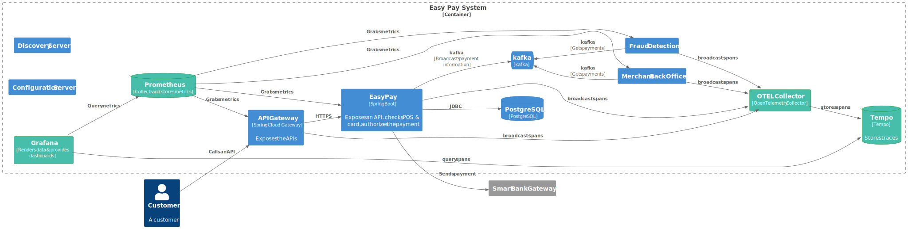

**author: David Pequegnot & Alexandre Touret
summary: Observability
id: observability-workshop
categories: observability
environments: Web
status: Published
feedback link: 

# Make your Java application fully observable with the Grafana Stack

## Introduction

This workshop aims to introduce how to make a Java application fully observable with:
* Proper logs with insightful information
* Metrics with Prometheus
* Distributed Tracing

During this workshop we will use the Grafana stack and Prometheus:

* Grafana: for dashboards
* Loki: for storing our logs
* Tempo: for storing traces
* Prometheus: for gathering and storing metrics. 

## Workshop overview
Duration: 0:02:00

### Application High Level Design


#### API Gateway
Centralises all API calls.

#### Easy Pay Service
Payment microservices which accepts (or not) payments.

This is how it validates every payment:
1. Check the POS number
2. Check the credit card number
3. Check the credit card type
4. Check the payment threshold, it calls the Smart Bank Gateway for authorization

If the payment is validated it stores it and broadcasts it to all the other microservices through Kafka.

#### Fraud detection Service

After fetching a message from the Kafka topic, this service search in its database if the payment's card number is registered for fraud.

In this case, only a WARN log is thrown.

#### Merchant Back Office Service

For this lab, it only simulates the subscription of messages.

#### Smart Bank Gateway
This external service authorizes the payment.

### Our fully observable platform


#### Short explanation


## Prerequisites
### Skills

| Skill                                                                                                                                                                                                                                                                                   | Level | 
|-----------------------------------------------------------------------------------------------------------------------------------------------------------------------------------------------------------------------------------------------------------------------------------------|---|
| [REST API](https://google.aip.dev/general)                                                                                                                                                                                                                                              | proficient |
| [Java](https://www.oracle.com/java/)                                                                                                                                                                                                                                                    | novice |   
| [Gradle](https://gradle.org/)                                                                                                                                                                                                                                                           | novice |
| [Spring Framework](https://spring.io/projects/spring-framework), [Boot](https://spring.io/projects/spring-boot), [Cloud Config](https://docs.spring.io/spring-cloud-config/docs/current/reference/html/#_quick_start), [Cloud Gateway](https://spring.io/projects/spring-cloud-gateway) | novice |
| [Docker](https://docs.docker.com/)                                                                                                                                                                                                                                                      | novice |
| [Grafana stack](https://grafana.com/)                                                                                                                                                                                                                                                   | novice |
| [Prometheus](https://prometheus.io/)                                                                                                                                                                                                                                                    | novice |
| [kafka](https://kafka.apache.org/)                                                                                                                                                                                                                                                      | novice |

### Tools
#### If you want to execute this workshop locally
You **MUST** have set up these tools first:
* [Java 21+](https://adoptium.net/temurin/releases/?version=21)
* [Gradle 8.5+](https://gradle.org/)
* [Docker](https://docs.docker.com/) & [Docker compose](https://docs.docker.com/compose/)
* Any IDE ([IntelliJ IDEA](https://www.jetbrains.com/idea), [VSCode](https://code.visualstudio.com/), [Netbeans](https://netbeans.apache.org/),...) you want
* [cURL](https://curl.se/), [jq](https://stedolan.github.io/jq/), [HTTPie](https://httpie.io/) or any tool to call your REST APIs

Here are commands to validate your environment:

**Java**

```jshelllanguage
java -version
openjdk version "21.0.1" 2023-10-17 LTS
OpenJDK Runtime Environment Temurin-21.0.1+12 (build 21.0.1+12-LTS)
OpenJDK 64-Bit Server VM Temurin-21.0.1+12 (build 21.0.1+12-LTS, mixed mode, sharing)
```

**Gradle**

If you use the wrapper, you won't have troubles. Otherwise...:

```jshelllanguage
$ gradle -version

------------------------------------------------------------
Gradle 8.5
------------------------------------------------------------

Build time:   2023-11-29 14:08:57 UTC
Revision:     28aca86a7180baa17117e0e5ba01d8ea9feca598

Kotlin:       1.9.20
Groovy:       3.0.17
Ant:          Apache Ant(TM) version 1.10.13 compiled on January 4 2023
JVM:          21.0.1 (Eclipse Adoptium 21.0.1+12-LTS)
OS:           Linux 5.15.133.1-microsoft-standard-WSL2 amd64
```

**Docker Compose**

``` bash
docker compose version
    
Docker Compose version v2.22.2
```

#### If you don't want to bother with a local setup

##### With Gitpod (recommended)
You can use [Gitpod](https://gitpod.io).
You must create an account first.
You then can open this project in either your local VS Code or directly in your browser:

[](https://gitpod.io/#github.com/alexandre-touret/observability-workshop.git)

## Environment Setup

Duration: 0:04:00

### Open GitPod

[](https://gitpod.io/#github.com/alexandre-touret/observability-workshop.git)

## Logs 
Duration: 0:05:00

## Metrics
Duration: 0:05:00

## Traces
Duration: 0:05:00

## Correlation
Duration: 0:05:00**

